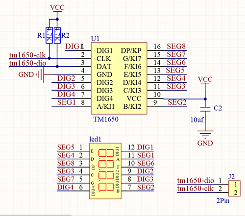

# **Project 9：Digital Tube Display**

### **1. Description**
This 4-Digit tube display is a device used to display counting or time, which is able to  display numbers from 0 ~ 9 and simple letters. It consists of four digital tubes, each of which has seven light-emitting diodes (LED). 


Moreover, multiple functions can be realized by connecting their pins to the Arduino development board, such as timekeeping and some game storing. 

### **2. Working Principle**



TM1650 utilizes IIC protocol and adopts two bus lines (SDA and SCL).

**Data Command:** 0x48. 
This command tells TM1650 to light up the digital tubes rather than key scanning.

**Display Command:**


Actually, it is one byte of data with different bits representing different functions.
**bit[6:4]:** Set the brightness of LED. Note that 000 indicates the brightest. 
**bit[3]:** Determine whether there is a decimal dot. 
**bit[0]:** Determine whether to turn on the display.

**Digital Tube Turns on**
Take an example: Level 8 brightness without a dot signifies 0x05. 
Steps: Starting signal — Send 0x48 — Slave-device receives — Send 0x05 — Slave-device receives — Ending signal
After turning on, there is no need to repeatedly send 0x48, as the function of digital tube has confirmed. 
Besides, the brightness and display methods can be enumerated with multiple data in one place, so that it is clear and space-saving.

**Digital Tube Turns off**
Steps: Starting signal — Send 0x48 — Slave-device receives — Send 0x00 — Slave-device receives — Ending signal

**Digital Tube Displays Numbers**
We firstly tell TM1650 to display numbers on the predetermined tube. And then the number will be displayed. Its eight bit corresponds to eight segment, with 1 for lighting up and 0 for lighting off. If there is a doubt of the corresponding relation, you may light up bit by bit in loop.

For example, when bit 1 is turned on and displays 8, the data is 0x68. If there is a dot, 8 will also be displayed when sending 0x7f.
Steps: Starting signal — Send 0x68 — Slave-device receives — Send 0x7f — Slave-device receives — Ending signal
Result: 8 is displayed on Bit 1. 

For convenience, an array of corresponding value to 0~9 can be made. After further improvement, it is able to display numbers, adjust brightness, shift the decimal dot and tubes.


### **3. Wiring Diagram**


### **4. Test Code**

 Upload library files on Arduino IDE firs.

**Code：**

```C
/*
  keyestudio ESP32 Inventor Learning Kit 
  Project 9.1 Digital Tube Display 
  http://www.keyestudio.com
*/
#include "TM1650.h"
#define CLK 22    //pins definitions for TM1650 and can be changed to other ports       
#define DIO 21
TM1650 DigitalTube(CLK,DIO);

void setup(){
  for(char b=0;b<4;b++){
    DigitalTube.clearBit(b);      //DigitalTube.clearBit(0 to 3); Clear bit display.
  }
}

void loop(){
    DigitalTube.displayFloatNum(9999);   //Values or variables added to the parentheses can be displayed through the digital tube 
}
```

### **5.  Test Result**

After connecting the wiring and uploading code, the digital tube display shows "9999", as shown below. 


### **6. Extended Code **

Let's have some difficult operations. Rather than static numbers, we handle it to show some dynamic ones. 
The following code manipulates the tubes to display 1~9999 by "for" loop.

**The wiring remains unchanged.**

**Code:**

```c
/*
  keyestudio ESP32 Inventor Learning Kit 
  Project 9.2 Digital Tube Display 
  http://www.keyestudio.com
*/
#include "TM1650.h"
#define CLK 22    //pins definitions for TM1650 and can be changed to other ports       
#define DIO 21
TM1650 DigitalTube(CLK,DIO);

void setup(){
  for(char b=0;b<4;b++){
    DigitalTube.clearBit(b);      //DigitalTube.clearBit(0 to 3); Clear bit display.
  }
}

void loop(){
  for(int num=0; num<10000; num++){   //If num is less than 10000, num will increase by 1 for each cycle
    DigitalTube.displayFloatNum(num);   //Values or variables in the parentheses can be displayed through the digital tube 
    delay(100);
  }
}
```

### **7. Code Explanation**

**TM1650 DigitalTube(CLK,DIO);**  Create an example for DigitalTube，and import the pin number connecting CLK to DIO into the code.

**DigitalTube.clear();** Clear the display 

**DigitalTube.displayFloatNum(num);** This is the digital tube display function, the maximum number is 9999.


