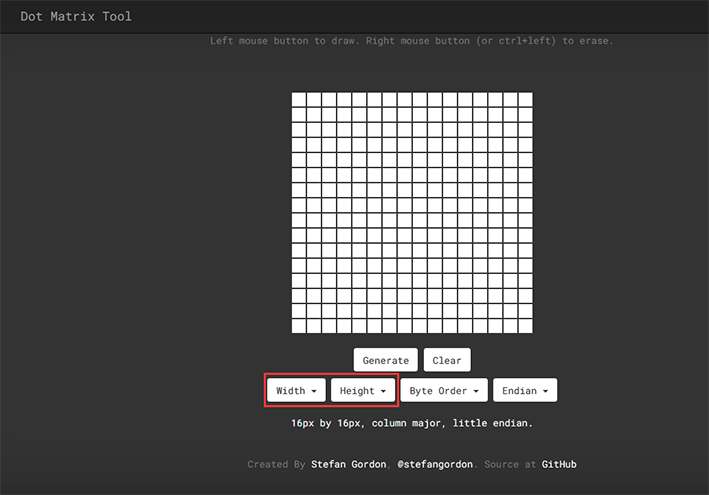
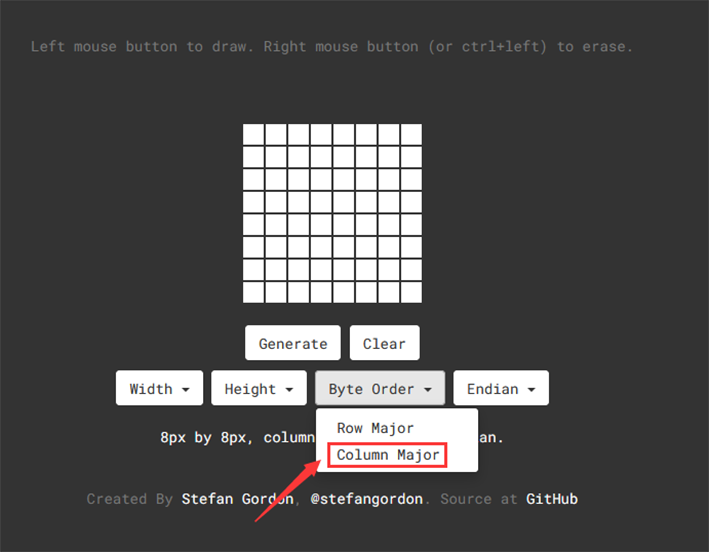
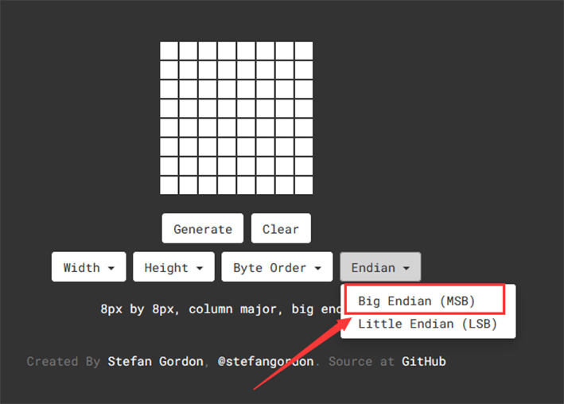
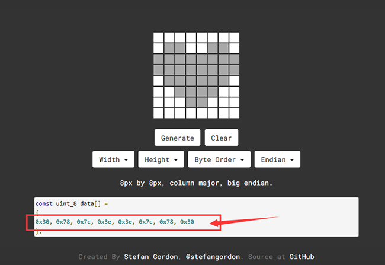
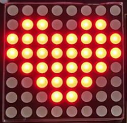

# **Project 10：Dot Matrix Display**

### **1. Description**
This module consists of a 8x8 LED dot matrix with one control pin for each row as well as each column to adjust the brightness of LED. Connecting with Arduino board, the brightness of LED is controlled to display characters and figures via Arduino programming. In this way, simple characters, numbers and figures are able to be displayed. It also can be applied in game machines or screens.

### **2. Working Principle**


MAX7219 is an IC with SPI communication and can be used to control the 8x8 dot matrix. The MAX7219 SPI communication has integrated in our libraries and you can recall directly.

### **Dot Matrix Modulo Operation**

Click the link for Modulo ：[http://dotmatrixtool.com/#](http://dotmatrixtool.com/#)

**Steps:**

1.Click the link and set the height and width of the dot matrix. Here we set both to 8. 

2.Set "Byte Order" to "Column Major".

3.Set "Endian" to "Big Endian".


4.Click the white tiles to form a pattern you want(click again for deselecting), and then click "Generate" to generate an array for this icon. Copy this array and paste it in code, and then the pattern will be displayed on the dot matrix.

### **3. Wiring Diagram**


### **4. Test Code**

 Add libraries to Arduino IDE first. 

```c
/*
  keyestudio ESP32 Inventor Learning Kit 
  Project 10 Dot Matrix Display
  http://www.keyestudio.com
*/

#include "LedControl.h"
int DIN = 23;
int CLK = 18;
int CS = 15;
LedControl lc=LedControl(DIN,CLK,CS,1);
const byte IMAGES[8] = {0x30, 0x78, 0x7c, 0x3e, 0x3e, 0x7c, 0x78, 0x30};

void setup() {
  lc.shutdown(0,false);
  // Set brightness to a medium value
  lc.setIntensity(0,8);
  // Clear the display
  lc.clearDisplay(0);  
}

void loop(){
  for(int i=0; i < 8; i++){
      lc.setRow(0,i,IMAGES[i]);
  }
}

```

### **5. Test Result**

After connecting the wiring and uploading code, a heart will be displayed on the dot matrix, as shown below.



### **6. Code Explanation**

 **lc.shutdown(0,false);**   Select the state of power saving mode, with false for exiting and true for entering. It will not display anything if entering this mode.

**lc.setIntensity(0,8);**  Set the range of brightness intensity to level 0-8, among which 8 is the brightest.

**lc.clearDisplay(0);**  Clear the pattern displayed on the dot matrix. 

**lc.setRow(0,i,IMAGES[i]);** It is a dot matrix display function, the first parameter is the address of the display we set to 0, the second parameter is the display line, we use for loop variable (0-7), the third parameter is to set the value of the dot call array displayed in the dot matrix  row.

