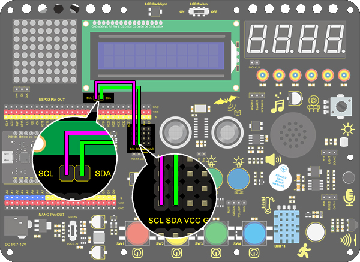

# **Project 11: LCD**

### **1. Description**
Arduino I2C 1602 LCD is a commonly-used auxiliary device for MCU development board to connect with external sensors and modules. It features a 16-bit wide character, 2-line LCD screen and adjustable brightness. This programable module is convenient for data editing, display and management . Besides, it can display not only characters and figures but sensors value, like temperature, humidity or pressure value. 

As a result of its usability, the display is wildly applied in many fields, including smart home products, industrial monitoring systems, robot control systems and automotive electronics systems.

### **2.  Working Principle**


It is the same as IIC communication principle. Underlying functions have been packaged in libraries so that you can recall them directly. If you are interested in these, you may have a further look of underlying driving principles. 

### **3. Wiring Diagram**



### **4. Test Code**

 Add libraries to Arduino IDE first.

```c
/*
  keyestudio ESP32 Inventor Learning Kit 
  Project 11 LCD
  http://www.keyestudio.com
*/
#include <Wire.h>
#include <LiquidCrystal_I2C.h>
LiquidCrystal_I2C lcd(0x27,16,2); // set the LCD address to 0x27 for a 16 chars and 2 line display
void setup()
{
lcd.init(); // initialize the lcd
// Print a message to the LCD.
lcd.backlight();		//Turn on the LCD backlight 
lcd.setCursor(2,0);		//Set the display position 
lcd.print("Hello,world!");		//LCD displays "Hello, world!"
lcd.setCursor(2,1);	
lcd.print("keyestudio!");		//LCD displays "keyestudio!"
}
void loop()
{
}
```

### **5. Test Result**

After connecting the wiring and uploading code, turn on the LCD,  "Hello, world!" and "keyestudio!" will be displayed on the LCD. 


If the characters are unclear, please fix the backlight potentiometer by the small slotted screwdriver(Please use appropriate force to adjust. Connect an external power supply if necessary.


### **6. Code Explanation**

**#include <LiquidCrystal_I2C.h>**	#include is a "include" command of libraries, so we can recall functions in file.h.

**LiquidCrystal_I2C lcd(0x27,16,2);**  Define an LCD. 0x27 is its IIC address, and 16 means the number of columns(display 16 characters in total), and 2 is the number of rows.

**lcd.init();**  Initialize LCD

**lcd.backlight();** Turn on LCD backlight, which clarifies the displayed characters. 

**lcd.setCursor(3,0);**  Set the display position. (3,0) indicates the the beginning of column 3, row 0.

**lcd.print("Hello, world!");**  Define the displayed characters. Enclose the strings in quotation marks, for instance, lcd.print("Hello, world!"). The marks can be omitted if displaying one value, for example, lcd.print(value). 


