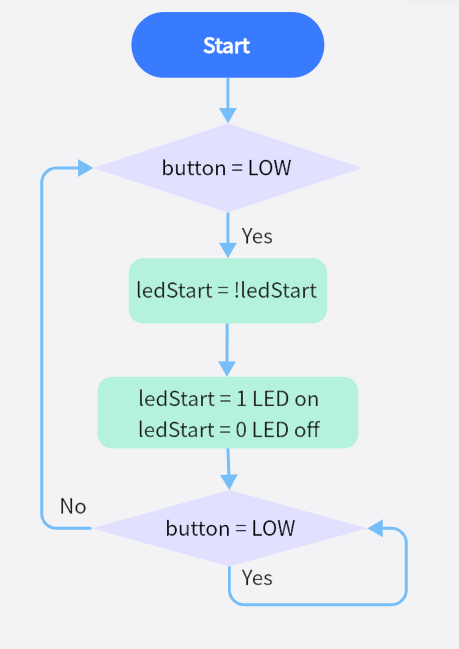

# **Project 13: Mini Lamp**

### **1. Description**
In this project, we are going to control a lamp via Arduino UNO and a button. When we press the button, the state of the lamp will shift(ON or OFF).

### **2. Working Principle**


When the button is released, a voltage VCC passing through R29 provides a high level for S terminal. 
When pressed, pin 1 and 3, pin 2 and 4 are connected and voltage on S1 arrives GND as a low level. At this moment, R29 avoids a short circuit between VCC and GND.

### **3. Wiring Diagram**


### **4.  Test Code**

We can read the pin voltage value via "digitalRead(Pin)", 1 for high and 0 for low.

```C
/*
  keyestudio ESP32 Inventor Learning Kit 
  Project 13.1 Mini Lamp
  http://www.keyestudio.com
*/
int button = 15;
int value = 0;
void setup() {
  Serial.begin(9600); //Set the serial baud rate to 9600 
  pinMode(button, INPUT);  //Connect the button pin to digital port 8 and set it to input mode.
}

void loop() {
  value = digitalRead(button);//Read the button value 
  Serial.print("Key status:"); //Print "Key status:" on serial port 
  Serial.println(value); //Print the button variable on the serial port and wrapping lines
}
```

### **5. Test Result**

After connecting the wiring and uploading code, open the serial monitor and set the baud rate to 9600. 
When we press the button, serial port prints "Key status: 0"; When we release it, serial port prints "Key status: 1".


### **6. Knowledge Expansion**

Next, we will control the LED through the state of buttons. 

**Flow Chart：**



**Wiring Diagram:**


**Code：**

Make a mini lamp with a button and a LED. 

```C
/*
  keyestudio ESP32 Inventor Learning Kit 
  Project 13.2 Mini Lamp
  http://www.keyestudio.com
*/
#define led	   4
#define button 15
bool ledState = false;

void setup() {
  // initialize digital pin PIN_LED as an output.
  pinMode(led, OUTPUT);
  pinMode(button, INPUT);
}

// the loop function runs over and over again forever
void loop() {
  if (digitalRead(button) == LOW) {    //When the button value is 0 for the first time, button jitter is triggered, so 20ms is delayed to judge whether the button is equal to 0. 
    delay(20);                              //Delay 20ms
    if (digitalRead(button) == LOW) {   //judge whether the button value is 0
      ledState = !ledState;                 //ledStart is equal to the inverse of its original value, which can be used to light the LED on and off 
      digitalWrite(led, ledState);
    }
    while (digitalRead(button) == LOW);     //hold the button for the while loop, exit it when release it
  }
}

```

### **7. Code Explanation**

**pinMode(button, INPUT);**  Set pin IO15 on the development board to input, so that the state of button can be identified. 
When we press the button, IO15 is at a low level(0. If we release it, IO15 will be at high(1.

**value = digitalRead(button);**  digitalRead(button) reads the high and low level (1 or 0) of the digital IO15 pin and assigns the button value to value.

**Serial.begin(9600);** Set the serial baud rate. It is necessary to print value on serial port.

**Serial.print("Key status:");**  Serial port prints value. Contents in print() will be printed. If it is character string, quotation marks are needed, for instance, "Key status:".

**Serial.println(button);**  Serial port prints contents in println() in a new line. Here we print the button value.

 **if (digitalRead(button) == LOW) { ... }**:  Determine if the button pin is equal to the low level. If so, execute the if statement {... }, otherwise not executed.

**!** takes the inverse operator, so if this value is 1, it's 0, and if it's 0, it's 1, so we can turn a light on and off by pressing a button.

**==**  is used to determine whether the value of the variable on the left is equal to the value on the right. Please refer to the official website for details: [https://www.arduino.cc/reference/en/](https://www.arduino.cc/reference/en/).


