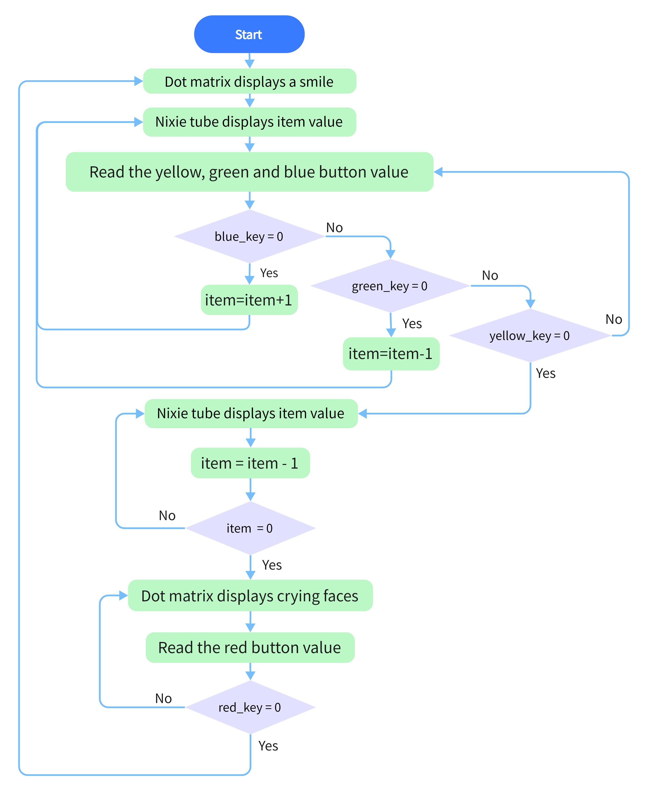
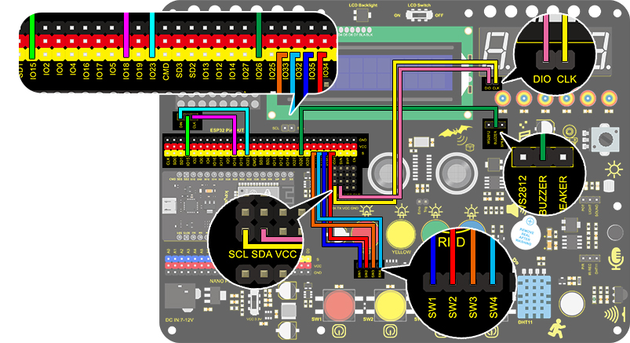

# **Project 16: Timebomb**

### **1. Description**

This project will give you an opportunity experience an interesting timebomb game.  

In this project, the dot matrix represents your timebomb, while the digital tube displays remaining time. Buttons can not only control the bomb but also set its time. You may set a countdown to control this bomb, and it explodes when the countdown is over. Beyond that, a buzzer is adopted to alarm. 

Anyhow, by programming on multiple sensors, your comprehensive capability of logic thinking can be enhanced. 

### **2. Flow Chart**



### **3. Wiring Diagram**



### **4. Test Code **

When mentioning a timebomb, we think of a timer and an activate button. In this project, however, it is an analog bomb, so we also need a reset button. We set blue for plus, green for minus, yellow for counting down and red for resetting. 
The time (unit: s) is displayed on digital tube and the 8x8 dot matrix shows the state of bomb(smile for safe and cry for explosion).

```C
/*
  keyestudio ESP32 Inventor Learning Kit  
  Project 16 Timebomb
  http://www.keyestudio.com
*/
#include "TM1650.h" //Upload TM1650 libraries 
#include "LedControl.h"
//Dot matrix
int DIN = 23;
int CLK = 18;
int CS = 15;
LedControl lc=LedControl(DIN,CLK,CS,1); 

byte smile[8]=   {0x20,0x44,0x22,0x02,0x02,0x22,0x44,0x20};//Smile face  
byte weep[8]= {0x20,0x42,0x24,0x04,0x04,0x24,0x42,0x20};//Crying face

// Button, buzzer and digital tube 
int item = 0; //displayed value 
TM1650 DigitalTube(22,21);   //Set the SCL pin of the digital tube to 22 and the DIO pin to 21 

int addition = 32;		//Set the plus button to IO32
int subtraction = 33;	//Set the minus button to IO33
int start = 34;			//Set the start button to IO34
int reset = 35;			//Set the reset button to IO35
int buzz = 26;			//Set the buzzer to IO26

int buzz_val = 1;		//The variable of buzzer

void printByte(byte character [])  //The dot matrix display function
{  
  int i = 0;  
  for(i=0;i<8;i++)  
  {  
    lc.setRow(0,i,character[i]);  
  }  
} 

void setup(){
  lc.shutdown(0,false);       //MAX72XX is in power saving mode when starting    
  lc.setIntensity(0,8);       //Set the brightness to the maximum   
  lc.clearDisplay(0);         //Clear the display  
 //Set the pin mode
  pinMode(addition,INPUT);		
  pinMode(subtraction,INPUT);
  pinMode(start,INPUT);
  pinMode(reset,INPUT);
  pinMode(buzz,OUTPUT);

  for(char b=0;b<4;b++){
    DigitalTube.clearBit(b);      //DigitalTube.clearBit(0 to 3); Clear bit display.
  }
}

void loop(){
  printByte(smile);		//Dot matrix displays a smile face  
  DigitalTube.displayFloatNum(item); //Digital tube displays the item value  
  int blue_key = digitalRead(addition);		//Read the button value 
  int green_key = digitalRead(subtraction);
  int yellow_key = digitalRead(start);
  if(blue_key == 0){	//Determine whether the button is pressed 
    item = item + 1;  	//+1
    delay(200);
  }
  if(green_key == 0 ){
    item = item - 1;  //-1
    delay(200);
  }
  
  if (item > 9999) {  //When the value is greater than 9999(exceeding the display range), reset 
    item = 0; 
  }
  if(yellow_key == 0){
    while(1){					//whlie()loop
      DigitalTube.displayFloatNum(item); //Digital tube displays the item value 
      item--;					//item--equals to item = item - 1
      delay(1000);
      buzz_val = !buzz_val;		//“！”takes the inverse runner. invert buzz_val
      digitalWrite(buzz,buzz_val);
      if(item == 0){
        digitalWrite(buzz,LOW);
        break;					//break to exit the loop
      
      }
    }
    while(item==0){				//when itme=0, enter loop 
      DigitalTube.displayFloatNum(item); //Digital tube displays the item value 
      printByte(weep);					//Display a crying face 
      int red_key = digitalRead(reset);
      if(red_key == 0){
        break;
      }
    }
  }

}


```

### **5. Test Result**

After connecting the wiring and uploading code, press blue button to add time, green to reduce and red to reset.
Press yellow button for counting down. When it is over, the bomb explodes. 

