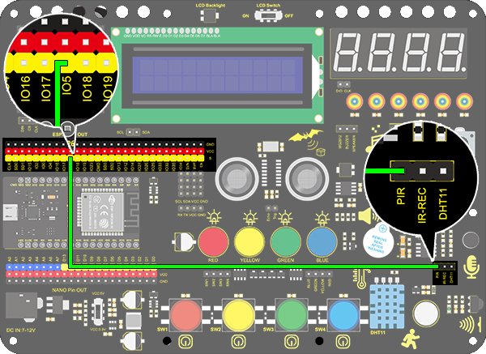
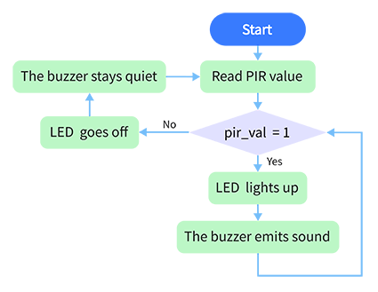
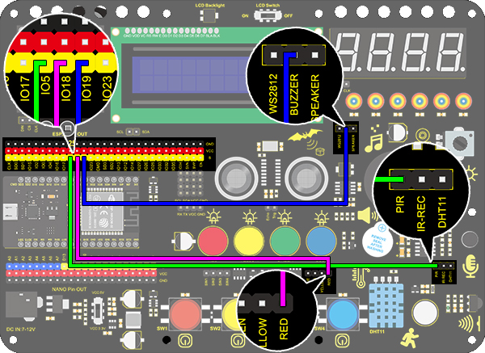

# **Project 17: Invasion Alarm**

### **1. Description**
This invasion alarm system is able to detect invaders in houses or small offices and warn the host to take measures in time. 

In this project, the sensor monitors a certain area. Some device on Arduino board will trigger LED to light up and buzzer to beep for caution if a movement is detected in that zone. 

Virtually, this module features practicability, easy installation and low costs. With the exception of home and office, it also applies to factories, warehouses and markets, which, to a large extent, protects property security.

### **2. Working Principle**


Human body(37°C) always emits infrared ray with a wavelength of 10μm, which approximates to that of the sensor detected. 
On this account, this module is able to detects human beings movement. If there is, PIR sensor outputs a high level about 3s. If not, it outputs a low level . 

### **3. Wiring Diagram**



### **4. Test Code**

From the working principle, we can read the level of the sensor pin to judge whether there are people nearby. 

```c
/*
  keyestudio ESP32 Inventor Learning Kit  
  Project 17.1 Invasion Alarm
  http://www.keyestudio.com
*/
int pir = 5;    //Define IO5 as PIR sensor pin 
void setup() {
  pinMode(pir,INPUT);   //Set IO5 pin to input 
  Serial.begin(9600);
}

void loop() {
  int pir_val = digitalRead(pir); 	//Read the PIR result and assign it to pir_val 
    Serial.print("pir_val:"); //Print “pir_val”
	Serial.println(pir_val);
    delay(500);
}

```

### **5. Test Result**

After connecting the wiring and uploading the code, open serial monitor to set baud rate to 9600, and the serial port prints the PIR value.


### **6. Knowledge Expansion**

Let's make an invasion alarm. When the PIR sensor detects human, LED lights up and the buzzer emits sound. In contrast, LED goes off and the buzzer stays quiet. 

**Flow Chart：**



**Wiring Diagram：**



**Code：**

To fulfil an invasion alarm, an "if() else" statement is necessary. 

```c
/*
  keyestudio ESP32 Inventor Learning Kit  
  Project 17.2 Invasion Alarm
  http://www.keyestudio.com
*/
int pir = 5;		//Set PIR sensor pin to IO5
int red_led = 18;	//Set red LED to pin IO18
int buzz = 19;		//Set buzzer to pin IO19

void setup() {
  // put your setup code here, to run once:
  pinMode(pir,INPUT);		//Set PIR pin to input mode 
  pinMode(red_led,OUTPUT);	//Set LED pin to output mode  
  pinMode(buzz,OUTPUT);		//Set buzzer pin to output mode 
}

void loop() {
  // put your main code here, to run repeatedly:
  int pir_val = digitalRead(pir);
  if(pir_val == 1){
    digitalWrite(red_led,HIGH);
    digitalWrite(buzz,HIGH);
  }
  else{
    digitalWrite(red_led,LOW);
    digitalWrite(buzz,LOW);
  }
}
```
