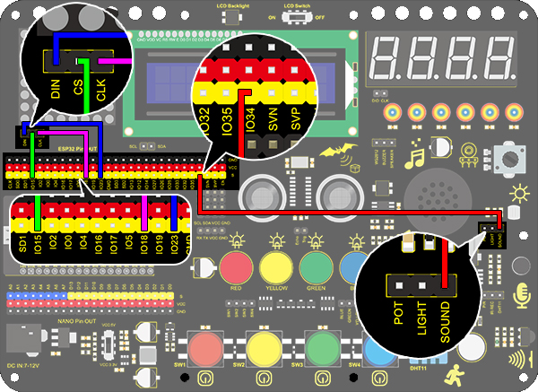

# **Project 22: Noise Meter**

### **1. Description**
Arduino noise meter embodies the sound signal to a series of dots, which are converted into patterns displayed on dot matrix. 

### **2. Wiring Diagram**



### **3. Test Code**

The noise meter is able to detect the ambient noise. 

```C
/*
  keyestudio ESP32 Inventor Learning Kit 
  Project 22 Noisemeter
  http://www.keyestudio.com
*/
#include <LedControl.h>  
  
int DIN = 23;
int CLK = 18;
int CS = 15;
int sensor = 34;

LedControl lc=LedControl(DIN,CLK,CS,1);  
byte data_val[8][8]= {
  {0x00, 0x00, 0x00, 0x00, 0x00, 0x00, 0x00, 0x01},
  {0x00, 0x00, 0x00, 0x00, 0x00, 0x00, 0x03, 0x01},
  {0x00, 0x00, 0x00, 0x00, 0x00, 0x07, 0x03, 0x01},
  {0x00, 0x00, 0x00, 0x00, 0x0f, 0x07, 0x03, 0x01},
  {0x00, 0x00, 0x00, 0x1f, 0x0f, 0x07, 0x03, 0x01},
  {0x00, 0x00, 0x3f, 0x1f, 0x0f, 0x07, 0x03, 0x01},
  {0x00, 0x7f, 0x3f, 0x1f, 0x0f, 0x07, 0x03, 0x01},
  {0xff, 0x7f, 0x3f, 0x1f, 0x0f, 0x07, 0x03, 0x01}
  };


void setup(){  
 lc.shutdown(0,false);       //When powering on, MAX72XX is in the power saving mode. 
 lc.setIntensity(0,8);       //Set the brightness to the maximum
 lc.clearDisplay(0);         //Clear the display 
}  
  
void loop(){   
  int val = analogRead(sensor);
  Serial.println(val);
  int temp = map(val,0,800,0,7);  //The range of analog values in the 0-800 is the most appropriate
  for(int i=0;i<8;i++)  
  {  
    lc.setRow(0,7-i,data_val[temp][i]);  
  } 
}  
```

### **4. Test Code**

After connecting the wiring and uploading code, the noise level view is displayed on dot matrix, as shown below.

                   

### **5. Code Explanation**

**data_val[ ] [ ]{ … };**  Two-dimensional array. If we use an axis X metaphor for linear array, two-dimensional array is axis X and Y. 
In this code, the value in the first square brackets is on axis X, and the second is on axis Y. For instance, column 3 and row 4, that is data_val[ 3] [4 ]. 

