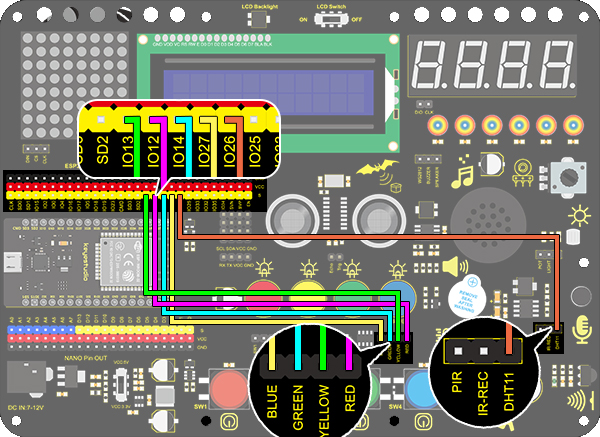

# **Project 23: Smart Cup**

### **1. Description**
In this project, we mainly adopt the Arduino development board to create a programmable smart cup, which reveals the temperature of inner liquid through a RGB indicator. It can control the brightness of the light by setting a temperature threshold. If the threshold is exceeded, it will get brighter. Otherwise, it gets darker. 

The smart cup enables to help users better control the temperature of their drinking water and effectively prevent overheating or freezing.

### **2. Working Principle**


### **3. Wiring Diagram**


### **4. Test Code**

Add libraries to Arduino IDE first.

```c
/*
  keyestudio ESP32 Inventor Learning Kit 
  Project 23.1 Smart Cup
  http://www.keyestudio.com
*/
#include <xht11.h>
xht11 xht(26);   //The DHT11 sensor connects to IO26
unsigned char dat[] = {0,0,0,0}; //Define an array to store temperature and humidity data

void setup() {
  // put your setup code here, to run once:
  Serial.begin(9600);
}

void loop() {
  // put your main code here, to run repeatedly:
  if (xht.receive(dat)) { //Check correct return to true
    Serial.print("RH:");
    Serial.print(dat[0]); //The integral part of humidity,dht[1] is the decimal part
    Serial.print("%  ");
    Serial.print("Temp:");
    Serial.print(dat[2]); //The integer part of the temperature,dht[3] is the decimal part
    Serial.println("C");
  } else {    //Read error
    Serial.println("sensor error");
  }
  delay(1500);  //Delay 1500ms
  
}

```

### **5. Test Result**

After connecting the wiring and uploading code, open serial monitor to set baud rate to 9600, and the temperature and humidity value will be displayed. 


### **6. Knowledge Expansion**

Now, we will make a smart cup which can show liquid temperature. We divide 100 into four parts with an LED, as shown below: 
**Red LED: ** 100-75°C
**Yellow LED: ** 75-50°C
**Green LED: ** 50-25°C
**Blue LED:**  25-0°C

**Wiring Diagram：**



**Code：**

```c
/*
  keyestudio ESP32 ESP32 Inventor Learning Kit 
  Project 23.2 Smart Cup
  http://www.keyestudio.com
*/
#include <xht11.h>
xht11 xht(26);                         //Define DHT11 to pin IO26
unsigned char dat[4] = { 0, 0, 0, 0 };  //Define an array to store temperature and humidity data

int yellow_led = 13;   //Define yellow_led to io13
int green_led = 14;    //Define green_led to io14
int blue_led = 27;     //Define blue_led to io27
int temperature = 0;  //Set a variable to save the temperature value
void setup() {
  // put your setup code here, to run once:
  pinMode(red_led, OUTPUT);     //Set io12 to ouput 
  pinMode(green_led, OUTPUT);   //Set io13 to ouput 
  pinMode(blue_led, OUTPUT);    //Set io14 to ouput 
  pinMode(yellow_led, OUTPUT);  //Set io27 to ouput 
  Serial.begin(9600);
}

void loop() {
  // put your main code here, to run repeatedly:
  if (xht.receive(dat)) {  //Check correct return to true
    temperature = dat[2];
    if (temperature > 75) {  // Determine whether value is greater than 75
      digitalWrite(green_led, LOW);
      digitalWrite(red_led, HIGH);
      digitalWrite(blue_led, LOW);
      digitalWrite(yellow_led,LOW);
    }
    if (temperature < 75 && temperature > 50) {  //Determine whether value is between 50 and 75 
      digitalWrite(green_led, LOW);
      digitalWrite(red_led, LOW);
      digitalWrite(blue_led, LOW);
      digitalWrite(yellow_led,HIGH);
    }
    if (temperature < 50 && temperature > 25) {  //Determine whether value is between 25 and 50 
      digitalWrite(green_led, HIGH);
      digitalWrite(red_led, LOW);
      digitalWrite(blue_led, LOW);
      digitalWrite(yellow_led,LOW);
    }
    if (temperature < 25) {  //Determine whether value is smaller than 25 
      digitalWrite(green_led, LOW);
      digitalWrite(red_led, LOW);
      digitalWrite(blue_led, HIGH);
      digitalWrite(yellow_led,LOW);
    }
  }
  delay(1500);  //Delay 1500ms
}

```

### **7. Code Explanation**

**xht11 xht(Pin);**   Set the instance named xht and add the pins 

**unsigned char dat[4] = { 0, 0, 0, 0 };**  dat[0] is the integer part of the humidity value. dat[1] is the decimal part of the humidity value. dat[2] is the integer part of the temperature value, and dat[3] is the decimal part of the temperature value

**&&**  (value < 100 && value > 75) means that, it is true only both expressions satisfying the condition, or else it is false. 

