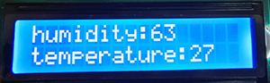

# **Project 24: Weather Station**

### **1. Description**
This weather station records the ambient temperature and humidity value via Arduino board and a temperature and humidity sensor. 

Moreover, it empowers to adjust temperature and humidity values according to environmental parameters as a way to achieve comfortable environmental conditions.

### **2. Wiring Diagram**


### **3. Test Code**

It is a simple weather device that responds to ambient humidity and temperature

```c
/*
  keyestudio ESP32 Inventor Learning Kit  
  Project 24：Weather Station
  http://www.keyestudio.com
*/
#include <LiquidCrystal_I2C.h>
#include <xht11.h>
LiquidCrystal_I2C lcd(0x27, 16,2);  // set the LCD address to 0x27 for a 16 chars and 2 line display
xht11 xht(26);                         //The DHT11 sensor connects to IO26
unsigned char dat[] = { 0, 0, 0, 0 };  //Define an array to store temperature and humidity data

void setup() {
  lcd.init();  // initialize the lcd
  lcd.backlight();
}

void loop() {
  if (xht.receive(dat)) {  //Check correct return to true
    lcd.setCursor(0, 0);
    lcd.print("humidity:");
    lcd.setCursor(9, 0);
    lcd.print(dat[0]);
    lcd.setCursor(0, 1);
    lcd.print("temperature:");
    lcd.setCursor(12, 1);
    lcd.print(dat[2]);
  }
  delay(1500);  //Delay 1500ms
}

```

### **4. Test Result**

After connecting the wiring and uploading code, the LCD display will directly discover the ambient humidity and temperature value. 


