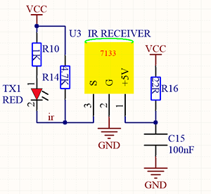
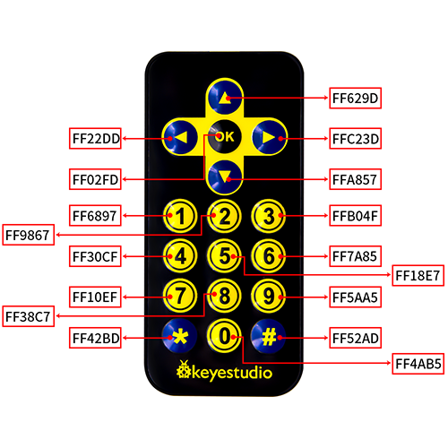
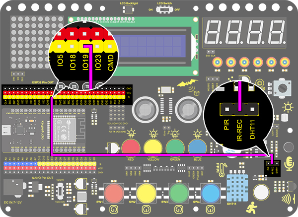
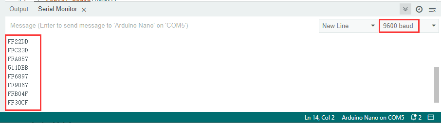
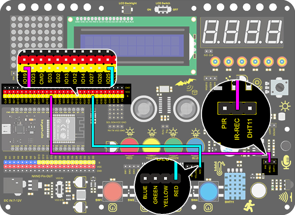

# **Project 29: IR Remote Control**

### **1. Description**
The IR remote control uses IR signal to control LED, which greatly simplifies the process of controlling LED. 

### **2. Working Principle**




 In this project, we often use a carrier of about 38K for modulation. 

IR remote control system includes modulation, emitting and receiving. It sends data through modulating, which improves the transmission efficiency and reduces the power consumption.

Generally, the frequency of carrier modulation is within 30khz~60khz(usually 38kHz). The duty cycle of the square wave is 1/3, as shown below, which is decided by the 455kHz crystal oscillator on the emitting end. 
An Integer frequency division is essential for crystal oscillator at this end, and the frequency coefficient usually evaluates 12. Therefore, 455kHz÷12≈37.9kHz≈38kHz. 

**38KH carrier (complete) emitting diagram:**


**Carrier frequency:** 38KHz

**Wave length:** 940nm

**Receiving angle:** 90°

**Control distance:** 6M

**Schematic diagram of remote control buttons:**




### **3. Wiring Diagram**



### **4. Test Code**

Add libraries to Arduino IDE first.

```C
/*
  keyestudio ESP32 Inventor Learning Kit  
  Project 29.1 IR Remote Control
  http://www.keyestudio.com
*/
#include <Arduino.h>
#include <IRremoteESP8266.h>
#include <IRrecv.h>
#include <IRutils.h>

const uint16_t recvPin = 19;  // Infrared receiving pin
IRrecv irrecv(recvPin);  // Create a class object used to receive class
decode_results results;   // Create a decoding results class object
long ir_rec;

void setup()
{
  Serial.begin(9600); // Initialize the serial port and set the baud rate to 9600
  irrecv.enableIRIn(); // start receiving signals
}

void loop() {
  if (irrecv.decode(&results)) {
    ir_rec = results.value; //assign the signal to the variable ir_rec
    if(ir_rec != 0){		//Prevente the code from repeating execute when the button is pressed 
    Serial.print(ir_rec, HEX); //Print the variable ir_rec in hexadecimal
    Serial.println();//Wrapping lines
    }
    irrecv.resume(); //Release the IR remote and receive the next value.
  }
} 

```

### **5. Test Result**

After connecting the wiring and uploading code, open the serial monitor and set the baud rate to 9600. 
Press the button on the remote control, and you will see the value in hexadecimal.



### **6. Knowledge Expansion**

Next, we will use an IR remote control to control the LED. Press OK to light up the LED and press again to turn it off. 

**Wiring Diagram：**



**Code：**

```C
/*
  keyestudio ESP32 Inventor Learning Kit 
  Project 29.2 IR Remote Control
  http://www.keyestudio.com
*/
#include <Arduino.h>
#include <IRremoteESP8266.h>
#include <IRrecv.h>
#include <IRutils.h>

int led = 25;
int led_val = 0;
const uint16_t recvPin = 19;  // Infrared receiving pin
IRrecv irrecv(recvPin);       // Create a class object used to receive class
decode_results results;       // Create a decoding results class object
long ir_rec;

void setup() {
  Serial.begin(9600);   // Initialize the serial port and set the baud rate to 9600
  irrecv.enableIRIn();  // start receiving signals
  pinMode(led, OUTPUT);
}

void loop() {
  if (irrecv.decode(&results)) {
    ir_rec = results.value;      //assign the signal to the variable ir_rec
    if (ir_rec != 0) {           //Prevente the code from repeating execute when the button is pressed
      if (ir_rec == 0xFF02FD) {  //Determine whether the received IR signal is from button OK
        led_val = !led_val;      //Reverse a variable. If the initial value is 0, it turns to 1 after reversing  
        digitalWrite(led, led_val);
      }
    }
    irrecv.resume();  //Release the IR remote and receive the next value.
  }
}

```

