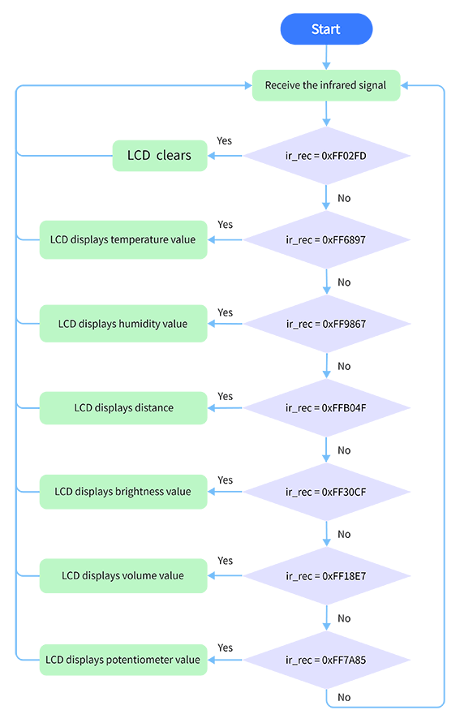
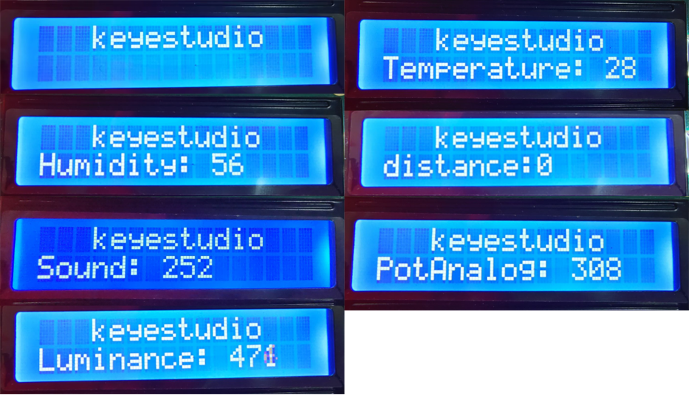

# **Project 30: Smart Home**

### **1. Description**
In this technology era, we are all familiar with smart home. It is a system that can control electric appliance via buttons. 

In this project, we seek to stimulate a smart home via an IR remote control. With Arduino MCU as its core, it can be used to  control light, air conditioners, TV and security monitors. 

### **2. Flow Chart**



### **3. Wiring Diagram**


### **4. Test Code**

With the IR remote control, this smart home reveals various sensor values on LCD, including a temperature and humidity sensor, a sound sensor, a photoresistor, a potentiometer and an ultrasonic sensor. 

```C
/*
  keyestudio ESP32 Inventor Learning Kit 
  Project 30 Smart Home
  http://www.keyestudio.com
*/
#include <LiquidCrystal_I2C.h>
#include <IRremoteESP8266.h>
#include <IRrecv.h>
#include <IRutils.h>
#include <xht11.h>

LiquidCrystal_I2C lcd(0x27, 16, 2);  // set the LCD address to 0x27 for a 16 chars and 2 line display

const uint16_t recvPin = 19;  // Infrared receiving pin
IRrecv irrecv(recvPin);       // Create a class object used to receive class
decode_results results;       // Create a decoding results class object
long ir_rec;

xht11 xht(26);                         //The DHT11 connects to IO26
unsigned char dat[] = { 0, 0, 0, 0 };  //Define an array to store temperature and humidity data

int distance = 0;  //Define a variable to receive the distance 
int EchoPin = 14;  //Connect Echo pin to IO14
int TrigPin = 13;  //Connect Trig pin to IO13

int ligth_sensor = 33;      //Define the photoresistor pin 
int sound_sensor = 32;      //efine the sound sensor pin
int pot_sensor = 25;        //Define the potentiometer pin
 
void setup() {
  //LCD 1602
  lcd.init();  // initialize the lcd
  lcd.backlight();  //Turn on the LCD backlight 
  lcd.setCursor(3, 0);
  lcd.print("keyestudio");  //LCD displays "keyestudio"
  //IR receiver
  irrecv.enableIRIn();  // start receiving signals
  //Ultrasonic
  pinMode(TrigPin, OUTPUT);  //Set Trig pin to output 
  pinMode(EchoPin, INPUT);   //Set Echo pin to input 
}
void loop() {
  if (irrecv.decode(&results)) {

    if (results.value != 0) {  //Prevent the button from being pressed repeatedly
      ir_rec = results.value;  //The signal is assigned to the variable ir_rec
      show_clear();
    }
    irrecv.resume();  //Release the IRremote and receive the next value.
  }
  switch (ir_rec) {
    case 0xFF02FD: show_clear(); break;
    case 0xFF6897: show_temperature(); break;
    case 0xFF9867: show_humidity(); break;
    case 0xFFB04F: show_distance(); break;
    case 0xFF30CF: show_luminance(); break;
    case 0xFF18E7: show_sound(); break;
    case 0xFF7A85: show_pot(); break;
  }
  delay(300);
}

void show_clear() {  //Clear display 
  lcd.setCursor(0, 1);
  lcd.print("                ");    
}

void show_temperature() {  //Display temperature
  if (xht.receive(dat)) {  //Check correct return to true
    lcd.setCursor(0, 1);
    lcd.print("Temperature:");
    lcd.setCursor(13, 1);
    lcd.print(dat[2]);
    if (dat[2] < 100) {
      lcd.setCursor(15, 1);
      lcd.print(" ");
    }
  }
}

void show_humidity() {     //Display humidity
  if (xht.receive(dat)) {  //Check correct return to true 
    lcd.setCursor(0, 1);
    lcd.print("Humidity:");
    lcd.setCursor(10, 1);
    lcd.print(dat[0]);
    Serial.println("2");
    if (dat[0] < 100) {
      lcd.setCursor(12, 1);
      lcd.print(" ");
    }
  }
}

float checkdistance() {  //Acquire distance
  // preserve a short low level to ensure a clear high pulse:
  digitalWrite(TrigPin, LOW);
  delayMicroseconds(2);
  // Trigger the sensor by a high pulse of 10um or longer
  digitalWrite(TrigPin, HIGH);
  delayMicroseconds(10);
  digitalWrite(TrigPin, LOW);
  // Read the signal from the sensor: a high level pulse
  //Duration is detected from the point sending "ping" command to the time receiving echo signal (unit: um).
  float distance = pulseIn(EchoPin, HIGH) / 58.00;  //Convert into distance
  delay(10);
  return distance;
}

void show_distance() {  //Display the distance 
  distance = checkdistance();
  // if (distance < 2 || distance >= 400) {  //Disolay "-1" if exceeding the detection range 
  //   distance = -1;
  // }
  lcd.setCursor(0, 1);
  lcd.print("distance:");
  lcd.setCursor(9, 1);
  lcd.print(distance);
  if (distance < 100 && distance > 10) {  //Eliminate the third residual digit when the value drops to two digits
    lcd.setCursor(11, 1);
    lcd.print(" ");
  }
  if (distance < 10) {  //Eliminate the second residual digit when the value drops to one digit
    lcd.setCursor(10, 1);
    lcd.print(" ");
  }
}

void show_luminance() {  //Read the analog value of photoresistor
  int value = analogRead(ligth_sensor);
  lcd.setCursor(0, 1);
  lcd.print("Luminance:");
  lcd.setCursor(11, 1);
  lcd.print(value);
  if (value < 1000) {
    lcd.setCursor(14, 1);
    lcd.print(" ");
  }
  if (value < 100) {
    lcd.setCursor(13, 1);
    lcd.print(" ");
  }
  if (value < 10) {
    lcd.setCursor(12, 1);
    lcd.print(" ");
  }
}

void show_sound() {  //Read the analog sound value 
  int value = analogRead(sound_sensor);
  lcd.setCursor(0, 1);
  lcd.print("Sound:");
  lcd.setCursor(7, 1);
  lcd.print(value);
  if (value < 1000) {
    lcd.setCursor(10, 1);
    lcd.print(" ");
  }
  if (value < 100) {
    lcd.setCursor(9, 1);
    lcd.print(" ");
  }
  if (value < 10) {
    lcd.setCursor(8, 1);
    lcd.print(" ");
  }
}

void show_pot() {  //Read the analog value of potentiometer 
  int value = analogRead(pot_sensor);
  lcd.setCursor(0, 1);
  lcd.print("PotAnalog:");
  lcd.setCursor(11, 1);
  lcd.print(value);
  if (value < 1000) {
    lcd.setCursor(14, 1);
    lcd.print(" ");
  }
  if (value < 100) {
    lcd.setCursor(13, 1);
    lcd.print(" ");
  }
  if (value < 10) {
    lcd.setCursor(12, 1);
    lcd.print(" ");
  }
}
```

### **5. Test Result**

After connecting the wiring and uploading code, we can see the corresponding contents on LCD by pressing buttons. OK button clears the sensor display.


