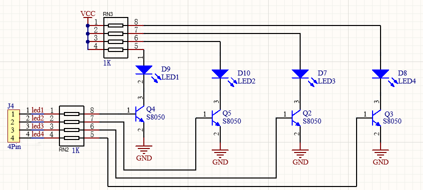
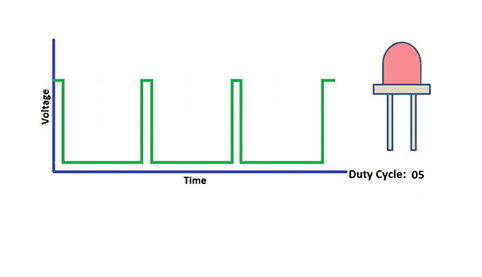
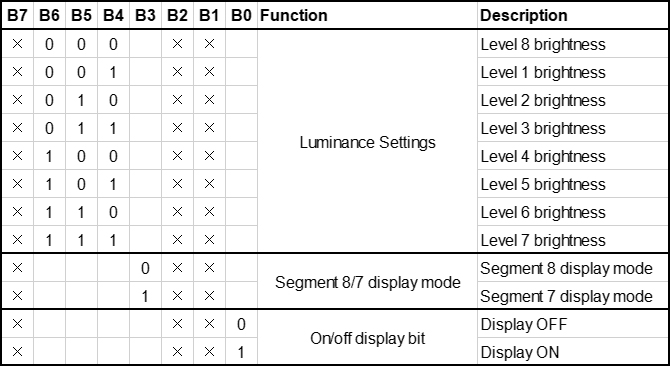
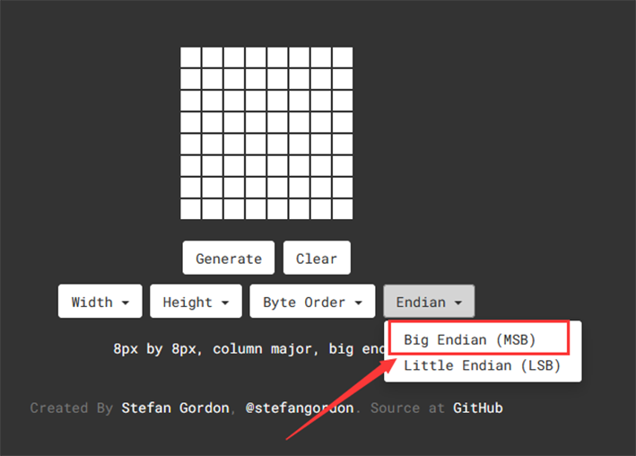
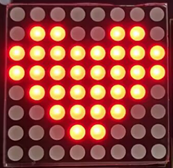
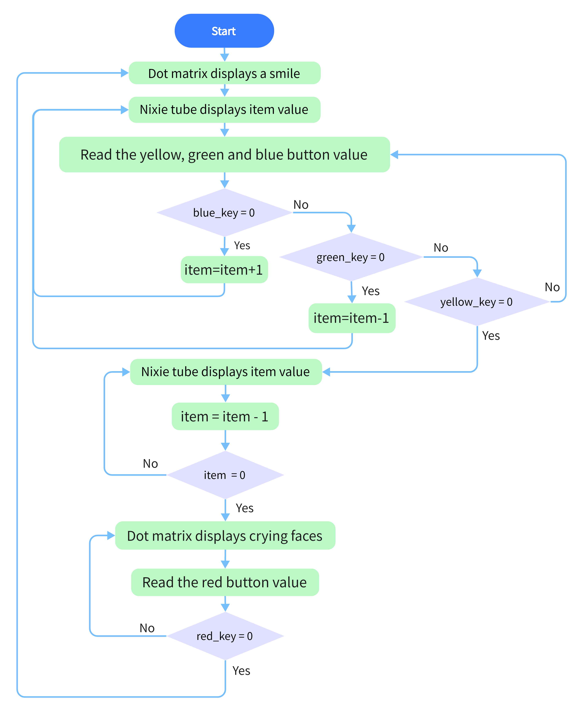
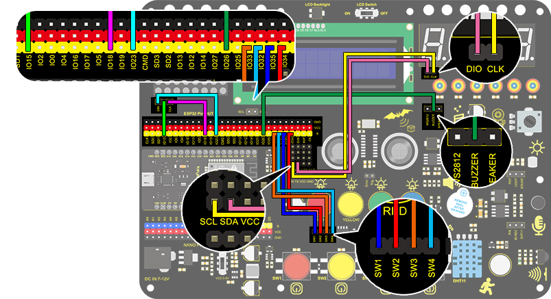
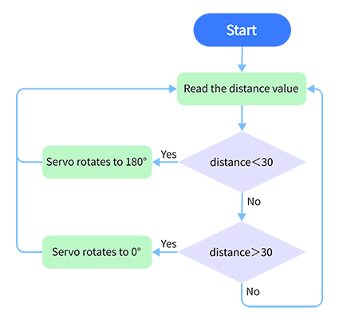

# Project

[DOWNLOAD](https://fs.keyestudio.com/FKS0001)

## **Project 1: LED Blinking**

###  **1. Description**

LED blinking is a simple project designed for starters. You only need to install an LED on Arduino board and upload the code on Arduino IDE. This project reinforces the learning of Arduino conceptual framework and using methods for starters. 

###  **2. Working Principle**



**LED:** The above is the circuit diagram of LED. Generally speaking, limited IO ports of output current may cause low brightness of LED, so a NPN triode (Q2) is applied in circuit as a switch. In this case, the LED will light up if the base(pin 1) of triode is at a high level. On the contrary, LED goes off when the base is at low. 

**Triode switch:** To have a clear idea of its principle, certain knowledge of electronic circuit is required. For details, please consult materials by yourself. 
Briefly, LED on and off rely on the high and low levels of triode base, which are decided by the pin on the development board. LED lights up when the base(pin 1) is at a high level, and it goes off when the base is at low.


### **3. Wiring Diagram**


###  **4. Test Code**

According to previous principles, we can control LED via levels of ESP32 pins. 

1. Define an variable as pin IO5 used for pin number modification. 
2. Set pin IO5 to output mode in setup( ). 
3. Set pin IO5 to output  “HIGH” and  “LOW” and delay for 1s respectively.
4. As a result, LED will be on and off for 1s. 

```C
/*
  keyestudio ESP32 Inventor Learning Kit
  Project 1: LED Blinking
  http://www.keyestudio.com
*/
int ledPin = 5; //Define LED to connect with pin IO5
void setup() {
  pinMode(ledPin, OUTPUT);//Set the mode to output
}

void loop() {
  digitalWrite(ledPin, HIGH); //Output a high level, LED lights up
  delay(1000);//Delay 1000ms 
  digitalWrite(ledPin, LOW); //Output a low level, LED goes off
  delay(1000);

}

```

###  **5. Test Result**

After uploading the code and powering on, LED will light up for 1s and off for 1 s.


### **6. Code Explanation**

**setup()Function**: It is used to initialize variables and pin modes and to enable the library. It runs once only after each time the board powering on or being reset. 

**loop()Function**: Followed by setup(), loop()function perpetually executes its code, such as read the pin or output the pin. 

**int ledPin = 3**: “int” is a variable within range of -32768 ~ 32767. This example code means we define an variable **ledpin** with an assignment of 5. Therefore, we adopt **ledpin** rather than “5” in later steps, which largely simplifies experimental recordings when considerable sensors and pins are included. 

**pinMode(pin,mode)**:"pin" is the pin number of mode setting. And the “mode” is optional for INPUT, OUTPUT, and INPUT_PULLUP. Here we set pin 3 to output mode. 

**digitalWrite(pin, value)**: “pin” is the digital tube pin of MCU, and here we define as pin 5. “value” is the digital output level (HIGH/LOW). 
If we apply pinMode() to set pin to OUTPUT, its voltage should be modified correspondingly. For instance, 5V (it is 3.3V if on a 3.3V-board) corresponds to HIGH, while 0V (GND) is for LOW.

However, if LED links with the pin rather than setting pinMode() to OUTPUT, LED may become dim when recalling digitalWrite(HIGH). This is because digitalWrite() enables the inner pull-up resistor, whose function is similar to a great current-limiting resistor. 

**delay(ms)** :It is a delay function and “ms” is the delay time in micro seconds. 

For more Arduino grammar explanations, please refer to: [https://www.arduino.cc/reference/en/](https://www.arduino.cc/reference/en/)

## **Project 2: Breathing LED**

### **1. Description**
Arduino breathing led utilizes on-board programmable PWM to output analog waveform. After powering on, LED brightness can be adjusted through duty cycle of the waveform to eventually realize the effect of breathing led. 
In this way, ambient light can be simulated by changing LED brightness over time. Also, breathing led can form a colorful mini light to construct a tranquil and warm environment.

### **2. What is PWM?**

PWM controls analog output via digital means, which is able to adjust duty cycle of the wave (a signal circularly shifting between high level and low level).

For Arduino, digital ports of voltage output are LOW and HIGH, which respectively correspond to 0V and 5V. Generally, we define LOW as 0 and HIGH as 1. Arduino will output 500 signals of 0 or 1 within 1s. If they are "1", 5V will be output. Oppositely, if they are all 0, the output will be 0V. Or if they are 010101010101..., the average output will be 2.5V. 

In other words, output ratio of 0 and 1 affects the voltage value, the more 0 and 1 signals are output per unit time, the more accurate the control will be. 

The GPIO34, 35, 36, and 39 of ESP32 cannot use PWM.




### **3. Wiring Diagram**


### **4. Test Code**

We adopt "for" statement to increase a variable from 0 to 255, and define the variable as PWM output (analogWrite(pin, value)). By the way, a delay time may reinforce the control of LED shining time. Next, we use another "for" statement to decrease it from 255 to 0 with a delay time to control LED dimming process. 

```C
/*
  keyestudio ESP32 Inventor Learning Kit 
  Project 2: Breathing LED
  http://www.keyestudio.com
*/
#define PIN_LED   5   //define the led pin
#define CHN       0   //define the pwm channel
#define FRQ       1000  //define the pwm frequency
#define PWM_BIT   8     //define the pwm precision
void setup() {
  ledcSetup(CHN, FRQ, PWM_BIT); //setup pwm channel
  ledcAttachPin(PIN_LED, CHN);  //attach the led pin to pwm channel
}

void loop() {
  for (int i = 0; i < 255; i++) { //make light fade in
    ledcWrite(CHN, i);
    delay(10);
  }
  for (int i = 255; i > -1; i--) {  //make light fade out
    ledcWrite(CHN, i);
    delay(10);
  }
}

```

### **5. Test Result**

After uploading the code, we can see that the LED dims gradually rather than all of a sudden. It "breathes" evenly.

### **6. Code Explanation**

**#define**: It is used to define constants ( unchanged)

**ledcSetup()**: It is used to set the frequency and count bits corresponding to the LEDC channel (duty ratio resolution)

The first parameter chan represents the channel number, which ranges from 0 to 15, and can set 16 channels. The high-speed channel (0 ~ 7) is driven by 80MHz clock, and the low-speed channel (8~ 15) is driven by 1MHz clock. The second parameter freq is the desired frequency. The third parameter is the count number of duty ratio resolution, which ranges from 0 to 20. (This value determines the writable value of duty ratio in the ledcWrite method. For example, if the value is 10, the maximum value of duty ratio is 1023, that is, (1<<bit_num)-1.

```c
double ledcSetup(uint8_t chan, double freq, uint8_t bit_num)
```

**ledcAttachPin()**: Its function is to bind the specified LEDC channel to the specified IO port to achieve PWM output.

The pin represents the IO port we want to output, and the channel is the LEDC channel we specify.

```c
void ledcAttachPin(uint8_t pin, uint8_t channel);
```

**ledcWrite()**: Its function is the output duty cycle of the specified LEDC channel.

The chan is the LEDC channel we specify. The duty  means duty cycle,  whose range depends on the bit_num of the ledcSetup() function.

```c
void ledcWrite(uint8_t chan, uint32_t duty)
```

**for (int i = 0; i <= 255; i ++){ ... }**:  It indicates that variable i ranges from 0 to 255, i++ means i increments by 1 each time until the judgment expression i <= 255 is not satisfied. Otherwise, the code in braces is executed for 256 times in total. 

**for (int i = 255; i >= 0; i --){ ... }**, i-- indicates that i is reduced by 1 each time. If i>= 0 is not satisfied, the for() loop is jumped out, and 256 times are executed in total.

**i++** : The variable will add 1 per loop

For more details, please refer to the link:[https://www.arduino.cc/reference/en/]( https://www.arduino.cc/reference/en/)


## **Project 3：SOS Distress Device**

### **1. Description**
Arduino SOS device is able to emit distress signals, which coincides with the principle of Morse code. It is convenient for emergencies.

### **2. Wiring Diagram**


### **3. Test Code**

What we should clear firstly is how SOS distress light blinks: LED quickly blinks 3 times for “S” and slowly blinks 3times for “O”. 
And then, we control the blinking times and duration via "for" statement and set interval time among letters. 

```C
/*
  keyestudio ESP32 Inventor Learning Kit 
  Project 3：SOS Distress Device
  http://www.keyestudio.com
*/
int ledPin = 5;  //Define pin as IO5
 
void setup() {
pinMode(ledPin, OUTPUT);
}
 
void loop() {
//Three quickly blinks mean “S”
for(int x=0;x<3;x++){
digitalWrite(ledPin,HIGH);            //Set LED to light up 
delay(150);                           //Delay 150ms 
digitalWrite(ledPin,LOW);             //Set LED to turn off 
delay(100);                           //Delay 100ms 
}
 
//delay 200ms to generate the space between letters
delay(200);
 
//Three slowly blinks mean “O”
for(int x=0;x<3;x++){
digitalWrite(ledPin,HIGH);            //Set LED to light up
delay(400);                           //Delay 400ms
digitalWrite(ledPin,LOW);             //Set LED to turn off
delay(200);                           //Delay 200ms
}
 
//Delay 100ms to generate the space between letters
delay(100);
 
// Three quickly blinks mean “S”
for(int x=0;x<3;x++){
digitalWrite(ledPin,HIGH);            //Set LED to light up
delay(150);                           //Delay 150ms
digitalWrite(ledPin,LOW);             //Set LED to turn off 
delay(100);                           //Delay 100ms
} 
// Wait 5s before repeating S.0.S
delay(5000);
}

```

### **4. Test Result**

After the code is successfully uploaded, we can see that the LED flashes 3 times quickly, then slowly flashes 3 times and then flashes 3 times quickly, then flash again 5s later.

## **Project 4: Traffic Light**

### **1. Description**
The traffic light module is a device used to control the route of pedestrians and vehicles. It includes a red, a yellow and a green light, which implies different instructions.

**Red for Stop:** Pedestrians and vehicles stop proceeding.

**Yellow for Caution:** Pedestrians and vehicles are ready for stopping. If the drive is already in process, the speed should be slow. 

**Green for Proceed:** Pedestrians and vehicles keep going with the abidance of traffic regulations. 

In this project, you can use Arduino to write code to control traffic lights. For instance, set the duration of each lights and the interval time among them. Besides, you may also add a timer to alter light colors to schedule. 


### **2. Wiring Diagram**


### **3. Test Code**

We simply stimulate the traffic lights: green LED lights up for 5s, yellow LED blinks for 3 times, and red LED lights up for 5s. And we set this to loop. 
The blinking of yellow LED can utilize for()statement we have mentioned in project 3. Thus, we only need to set the lighting time to complete a traffic light. 

```C
/*
  keyestudio ESP32 Inventor Learning Kit 
  Project 4 Traffic Light
  http://www.keyestudio.com
*/
int greenPin = 27;   //Green LED connects to IO27
int yellowPin = 26; //Yellow LED connects to IO26
int redPin = 25;   //Red LED connects to IO25
void setup() {
  //Set all LED interfaces to output mode
  pinMode(greenPin, OUTPUT);
  pinMode(yellowPin, OUTPUT);
  pinMode(redPin, OUTPUT);
}

void loop() {
  digitalWrite(greenPin, HIGH); //Light green LED up 
  delay(5000);  //Delay 5s
  digitalWrite(greenPin, LOW); //Turn green LED off 
  for (int i = 1; i <= 3; i++) {  //Execute for 3 times
    digitalWrite(yellowPin, HIGH); //Light yellow LED up
    delay(500); //Delay 0.5s
    digitalWrite(yellowPin, LOW); // Turn yellow LED off
    delay(500); //Delay 0.5s
  }
  digitalWrite(redPin, HIGH); //Light red LED up 
  delay(5000);  //Delay 5s 
  digitalWrite(redPin, LOW); //Turn red LED off 

}
```

### **4. Test Result**

After uploading the code, green LED will light up for 5s, yellow LED will blink for 3 times, and red LED will light up for 5s, in circulation. 


## **Project 5：Rainbow Ambient Light**

### **1. Description**
Arduino 2812RGB LED is a programable colorful dreamy light, whose color, brightness and rhythm are adjustable.  This rainbow ambient light can be used as a dynamic decoration at will. Or you may control it to "dance with music". Importantly, it can be improved as an alarm. Its built-in sensor detects the ambient surroundings to warn users by changing  its color, brightness and rhythm.

### **2. Working Principle**


The data protocol adopts communication mode of single-line return-to-zero code. After the pixel is reset on power, DIN terminal receives data from the controller. The firstly arriving 24bit data will be extracted by the first pixel and be sent to the inner data register. 

Remaining data will be amplified by an amplification circuit and be transmitted through DOUT port to the next cascaded pixel. 
Being transmitted through pixels, the signal decreases 24bit each time. 

Besides, The pixel adopts automatic shaping and forwarding technology, insomuch that the cascade number of the pixel is only limited by the signal transmission speed.

### **3. Wiring Diagram**


### **4. Test Code**

Before uploading the code, please ensure the library file is loaded to arduino IDE. 

```C
/*
  keyestudio ESP32 Inventor Learning Kit 
  Project 5.1  Rainbow Ambient Light
  http://www.keyestudio.com
*/
//Add 2812RGB library file
#include <NeoPixel_ESP32.h>

#define PIN 15

Adafruit_NeoPixel strip = Adafruit_NeoPixel(6, PIN);  //Defines the instance strip and assigns the RGB LED number pins to the library code

void setup() {
  strip.begin();        //Activate RGB LED
  strip.show(); // Refresh the display
}

void loop() {
  strip.setPixelColor(0, strip.Color(255, 0, 0));       //The frist RGB LED is red 
  strip.setPixelColor(1, strip.Color(0, 255, 0));       //The second RGB LED is green  
  strip.setPixelColor(2, strip.Color(0, 0, 255));       //The third RGB LED is blue 
  strip.setPixelColor(3, strip.Color(255, 255, 0));     //The fourth RGB LED is yellow 
  strip.setPixelColor(4, strip.Color(255, 0, 255));     //The fifth RGB LED is purple 
  strip.setPixelColor(5, strip.Color(255, 255, 255));   //The sixth RGB LED is white 
  strip.show();       //Refresh the display
  delay(100);         //Give a delay to save the stability of the display
}
```

### **5. Test Result**

After uploading the code, wiring up and powering on, the LED will light up in different colors.


### **6. Extended Code**


Specifically, we replace RGB value with variables. And then we control these variables to form an expected light show. 

The wirings remain unchanged.

```C
/*
  keyestudio ESP32 Inventor Learning Kit  
  Project 5.2  Rainbow Ambient Light
  http://www.keyestudio.com
*/
//Add 2812RGB library file
#include <NeoPixel_ESP32.h>

#define PIN 15

Adafruit_NeoPixel strip = Adafruit_NeoPixel(6, PIN, NEO_GRB + NEO_KHZ800);

void setup() {
  strip.begin();
  strip.show(); // Initialize all pixels to 'off'
}

void loop() {
  // Some example procedures showing how to display to the pixels:
  colorWipe(strip.Color(255, 0, 0), 50); // Red
  colorWipe(strip.Color(0, 255, 0), 50); // Green
  colorWipe(strip.Color(0, 0, 255), 50); // Blue
  // Send a theater pixel chase in...
  theaterChase(strip.Color(127, 127, 127), 50); // White
  theaterChase(strip.Color(127,   0,   0), 50); // Red
  theaterChase(strip.Color(  0,   0, 127), 50); // Blue

  rainbow(20);
  rainbowCycle(20);
  theaterChaseRainbow(50);
}

// Fill the dots one after the other with a color
void colorWipe(uint32_t c, uint8_t wait) {
  for(uint16_t i=0; i<strip.numPixels(); i++) {
      strip.setPixelColor(i, c);
      strip.show();
      delay(wait);
  }
}

void rainbow(uint8_t wait) {
  uint16_t i, j;

  for(j=0; j<256; j++) {
    for(i=0; i<strip.numPixels(); i++) {
      strip.setPixelColor(i, Wheel((i+j) & 255));
    }
    strip.show();
    delay(wait);
  }
}

// Slightly different, this makes the rainbow equally distributed throughout
void rainbowCycle(uint8_t wait) {
  uint16_t i, j;

  for(j=0; j<256*5; j++) { // 5 cycles of all colors on wheel
    for(i=0; i< strip.numPixels(); i++) {
      strip.setPixelColor(i, Wheel(((i * 256 / strip.numPixels()) + j) & 255));
    }
    strip.show();
    delay(wait);
  }
}

//Theatre-style crawling lights.
void theaterChase(uint32_t c, uint8_t wait) {
  for (int j=0; j<10; j++) {  //do 10 cycles of chasing
    for (int q=0; q < 3; q++) {
      for (int i=0; i < strip.numPixels(); i=i+3) {
        strip.setPixelColor(i+q, c);    //turn every third pixel on
      }
      strip.show();
     
      delay(wait);
     
      for (int i=0; i < strip.numPixels(); i=i+3) {
        strip.setPixelColor(i+q, 0);        //turn every third pixel off
      }
    }
  }
}

//Theatre-style crawling lights with rainbow effect
void theaterChaseRainbow(uint8_t wait) {
  for (int j=0; j < 256; j++) {     // cycle all 256 colors in the wheel
    for (int q=0; q < 3; q++) {
        for (int i=0; i < strip.numPixels(); i=i+3) {
          strip.setPixelColor(i+q, Wheel( (i+j) % 255));    //turn every third pixel on
        }
        strip.show();
       
        delay(wait);
       
        for (int i=0; i < strip.numPixels(); i=i+3) {
          strip.setPixelColor(i+q, 0);        //turn every third pixel off
        }
    }
  }
}

// Input a value 0 to 255 to get a color value.
// The colours are a transition r - g - b - back to r.
uint32_t Wheel(byte WheelPos) {
  if(WheelPos < 85) {
   return strip.Color(WheelPos * 3, 255 - WheelPos * 3, 0);
  } else if(WheelPos < 170) {
   WheelPos -= 85;
   return strip.Color(255 - WheelPos * 3, 0, WheelPos * 3);
  } else {
   WheelPos -= 170;
   return strip.Color(0, WheelPos * 3, 255 - WheelPos * 3);
  }
}
```

### **7. Code Explanation**

**#include <NeoPixel_ESP32.h>** : Libraries are included, so that codes in library can be directly recalled. 

**Adafruit_NeoPixel strip = Adafruit_NeoPixel(6, PIN);**   Define an instance strip and set the number of RGB. Here we input 6.

PIN = 15

**strip.begin();** Initialize 2812RGB 

**strip.setPixelColor(uint16_t n, uint8_t color);** The uint16_t m is used to set the number of 2812RGB and the second parameter is the value of the displayed color.

**strip.Color(uint8_t red , uint8_t green , uint8_t blue);**Set the color function. The value range of the three parameters( red, green and blue) is (0-255. We can synthesize various colors by setting the values of the three colors.

**strip.show();** Display 2812RGB

## **Project 6：Water Flow Light**
### **1. Description**
This simple water flow light project enables to help you learn electronic packaging. In this project, we will control LEDs to change the color in a specified speed via a Arduino board.

### **2. Wiring Diagram**


### **3. Test Code**

A water flow light means that LED lights go from left to right and then from right to left.
In this experiment, we use continuous pins, so that "for" statement can be utilized not only to set output mode (replace pins with circular variable in code) but to output. 

```C
/*
  keyestudio ESP32 Inventor Learning Kit  
  Project 6 Water Flow Light
  http://www.keyestudio.com
*/
void setup() {
  for(int i = 12;i <= 15 ;i++){   //Use "for" loop statement to set IO12-IO15 pin to output mode
    pinMode(i,OUTPUT);
  }
}

void loop() {
  for(int i = 12; i <= 15; i++){		//Use "for" loop statement to light up LED on IO12-IO15 pin in sequence 
    digitalWrite(i,HIGH);
    delay(200);
    digitalWrite(i,LOW);
  }
  for(int i = 15; i >= 12; i--){		//Use "for" loop statement to light up LED on IO15-IO12 pin in sequence   
    digitalWrite(i,HIGH);
    delay(200);
    digitalWrite(i,LOW);
  }
  
}

```

### **4.  Test Result**

After uploading code and powering on, the LEDs go from left to right and then from right to left

### **6. Code Explanation**

**for(int i = 12;i <= 15 ;i++){    pinMode(i,OUTPUT);    }**  : We can use "for" statement to define continuous pins. Yet it features a disadvantage of non-replacement ability of pins, which deteriorates the code portability. 

**for(int i = 12; i <= 15; i++){**
    		**digitalWrite(i,HIGH);**
    		**delay(200);**
    		**digitalWrite(i,LOW);**
  **}**     

In the first loop, LED on IO12 pin will light up and off after a 200ms delay. At the second time, LED on IO13 pin will turn on and off also after a 200ms delay. Until the IO15 pin is extinguished and the for loop is popped out, and the second for loop is the same except from IO15 pin to IO12 pin.

## **Project 7： Active Buzzer**
### **1. Description**
An active buzzer is a component used as an alarm, a reminder or an entertaining device, which boasts a reliable sound.
What's more, it empowers to stimulate highly controllable sounds, making our projects more interesting.

### **2. Working Principle**


An active buzzer integrates a multi-vibrator, so it makes sound only via DC voltage. Pin 1 of the buzzer connects to VCC and pin 2 is controlled by a triode. When a high level is provided for the base (pin 1) of the triode, its collector (pin 3) and emitter (pin 2) link to GND, and then the buzzer emits sound. 
Oppositely, if we offer a low level to the base, the rest of pins will be disconnected, so the buzzer will remain quiet.

### **3. Wiring Diagram**


### **4. Test Code**

If the development board outputs a high level, the buzzer will emit sound. If it outputs a low level, the buzzer will stop ringing. 
Thus, its code is similar to light up an LED.

```C
/*
  keyestudio ESP32 Inventor Learning Kit
  Project 7 Active Buzzer
  http://www.keyestudio.com
*/
int buzzer = 5; //Define buzzer connected to IO5 pin 
void setup() {
  pinMode(buzzer, OUTPUT);//Set the output mode 
}

void loop() {
  digitalWrite(buzzer, HIGH); //IO5 pin outputs a high level to cause the buzzer to emit sound 
  delay(1000);					//Delay 1000ms
  digitalWrite(buzzer, LOW); //IO5 outputs a low level to prevent the buzzer to emit sound 
  delay(1000);
}
```

### **5. Test Result**

After uploading code and powering on, the buzzer emits sound for 1s and stays quiet for 1s. 

## **Project 8：Music Performer**

### **1. Description**
In this project, we will use a power amplifier speaker to play music. This speaker can not only play simple songs, but also perform what you desire. Thus, you can program other interesting codes in the project to accomplish splendid learning outcomes.

### **2.  Working Principle**


The electrical signal is input from pin 1 of RP1 (adjusts signal intensity, which is also the sound volume).
After coupling in C4 and passing R5, the signal reaches IN- pin of 8002B, in which it is operationally amplified and output to BEE1 speaker. 

**Frequency Comparison Table in C**

|    Note     | Frequency(Hz) |      Note      | Frequency(Hz) |     Note     | Frequency(Hz) |
| :---------: | :-----------: | :------------: | :-----------: | :----------: | :-----------: |
| Flat  1  Do |      262      | Natural  1  Do |      523      | Sharp  1  Do |     1047      |
| Flat  2  Re |      294      | Natural  2  Re |      587      | Sharp  2  Re |     1175      |
| Flat  3  Mi |      330      | Natural  3  Mi |      659      | Sharp  3  Mi |     1319      |
| Flat  4  Fa |      349      | Natural  4  Fa |      698      | Sharp  4  Fa |     1397      |
| Flat  5  So |      392      | Natural  5  So |      784      | Sharp  5  So |     1568      |
| Flat  6  La |      440      | Natural  6  La |      880      | Sharp  6  La |     1760      |
| Flat  7  Si |      494      | Natural  7  Si |      988      | Sharp  7  Si |     1967      |

### **3.  Wiring Diagram**


### **4. Test Code**

According to the comparison table, we set a pin to output mode. 
And we use function "tong(Pin , frequency);" to generate square waves in certain frequency to emit corresponding sound. 
Finally, the notes will be output after adding a delay time.

```C
/*
  keyestudio ESP32 Inventor Learning Kit 
  Project 8.1 Music Performer 
  http://www.keyestudio.com
*/
int beeppin = 5; //Define the speaker pin to IO5
void setup() {
  pinMode(beeppin, OUTPUT);//Define the IO5 port to output mode 
}

void loop() {
  tone(beeppin, 262);//Flat DO plays 500ms
  delay(500);
  tone(beeppin, 294);//Flat Re plays 500ms
  delay(500);
  tone(beeppin, 330);//Flat Mi plays 500ms
  delay(500);
  tone(beeppin, 349);//Flat Fa plays 500ms
  delay(500);
  tone(beeppin, 392);//Flat So plays 500ms
  delay(500);
  tone(beeppin, 440);//Flat La plays 500ms 
  delay(500);
  tone(beeppin, 494);//Flat Si plays 500ms 
  delay(500);
  noTone(beeppin);//Stop for 1s 
  delay(1000);
}
```

### **5.  Test Result**

After uploading code and powering on, the amplifier circularly plays music tones with corresponding frequency: DO, Re, Mi, Fa, So, La, Si.


**Power amplifier sound adjustment：**

 **There is a potentiometer next to the speaker. We can adjust the sound of the speaker by twisting it. ** (Note: Please use appropriate strength to adjust it, so as not to break the potentiometer) 


### **6. Knowledge Expansion**

 Let's play a birthday song. The wirings remain unchanged.

**Numbered musical notation:**


**Comparison Diagram of Flat, Natural and Sharp**


**Code：**

~~~C
/*
  keyestudio ESP32 Inventor Learning Kit  
  Project 8.2 Music Performer
  http://www.keyestudio.com
*/
int beeppin = 5; //Define the speaker pin to IO5
// do、re、mi、fa、so、la、si
int doremi[] = {262, 294, 330, 370, 392, 440, 494,      //Falt 0-6
                523, 587, 659, 698, 784, 880, 988,      //Natural 7-13
                1047,1175,1319,1397,1568,1760,1967};    //Sharp 14-20
int happybirthday[] = {5,5,6,5,8,7,5,5,6,5,9,8,5,5,12,10,8,7,6,11,11,10,8,9,8};   //Find the number in arrey doremi[] according to the numbered musical notation 
int meter[] = {1,1,2,2,2,4, 1,1,2,2,2,4, 1,1,2,2,2,2,2, 1,1,2,2,2,4};    // Beats

void setup() {
  pinMode(beeppin, OUTPUT); //Set IO5 pin to output mode 
}

void loop() {
  for( int i = 0 ; i <= 24 ;i++){       //i<=24, because there are only 24 tones in this song
    //Use tone()function to generate a waveform in "frequency"
   tone(beeppin, doremi[happybirthday[i] - 1]);
   delay(meter[i] * 200); //Wait for 1000ms
   noTone(beeppin);//Stop singing
  }
}

~~~

###  **7. Code Explanation**

**doremi[]{ … };**
Linear array is used to store data, which generally are considered as a series of variables of the same type. 
Analogically, data are neatly put in ordered boxes, so that we can take the sequenced numbers to use corresponding data.

**tone(pin, frequency)；** 
"pin" is the arduino pin generating tones in a total of 6 pins. "frequency" is the note frequency in the unit of Hz. 

**unsigned int** is the data type within range of 0 ~ 65, 535 ((2^16) - 1.

1. "tone" function controls the module to generate square waves in certain frequency(duty cycle of 50％). It sings until "noTone()"(Stop to sing) is activated. 
2. Tones can be emitted by connecting the pin to a piezoelectric buzzer or other speakers. 
3. For each time, tone() generates only one type of tone. Thus, if a tone is played on some pins, this function will be invalid. 
4. tone()function disturbs the PWM output on pin 3 and pin 11 (on any board excluding Mega). 
5. The sound frequency generated by tone() must be more than 31Hz. So when you play tones in different frequency on numerous pins, noTone() is necessary on one pin and followed by tone() on next pin.

**noTone(beeppin);**
It stops the tone generation(stops singing). You can directly add the pin number. 


## **Project 9：Digital Tube Display**

### **1. Description**
This 4-Digit tube display is a device used to display counting or time, which is able to  display numbers from 0 ~ 9 and simple letters. It consists of four digital tubes, each of which has seven light-emitting diodes (LED). 


Moreover, multiple functions can be realized by connecting their pins to the Arduino development board, such as timekeeping and some game storing. 

### **2. Working Principle**


TM1650 utilizes IIC protocol and adopts two bus lines (SDA and SCL).

**Data Command:** 0x48. 
This command tells TM1650 to light up the digital tubes rather than key scanning.

**Display Command:**



Actually, it is one byte of data with different bits representing different functions.
**bit[6:4]:** Set the brightness of LED. Note that 000 indicates the brightest. 
**bit[3]:** Determine whether there is a decimal dot. 
**bit[0]:** Determine whether to turn on the display.

**Digital Tube Turns on**
Take an example: Level 8 brightness without a dot signifies 0x05. 
Steps: Starting signal — Send 0x48 — Slave-device receives — Send 0x05 — Slave-device receives — Ending signal
After turning on, there is no need to repeatedly send 0x48, as the function of digital tube has confirmed. 
Besides, the brightness and display methods can be enumerated with multiple data in one place, so that it is clear and space-saving.

**Digital Tube Turns off**
Steps: Starting signal — Send 0x48 — Slave-device receives — Send 0x00 — Slave-device receives — Ending signal

**Digital Tube Displays Numbers**
We firstly tell TM1650 to display numbers on the predetermined tube. And then the number will be displayed. Its eight bit corresponds to eight segment, with 1 for lighting up and 0 for lighting off. If there is a doubt of the corresponding relation, you may light up bit by bit in loop.

For example, when bit 1 is turned on and displays 8, the data is 0x68. If there is a dot, 8 will also be displayed when sending 0x7f.
Steps: Starting signal — Send 0x68 — Slave-device receives — Send 0x7f — Slave-device receives — Ending signal
Result: 8 is displayed on Bit 1. 

For convenience, an array of corresponding value to 0~9 can be made. After further improvement, it is able to display numbers, adjust brightness, shift the decimal dot and tubes.


### **3. Wiring Diagram**


### **4. Test Code**

 Upload library files on Arduino IDE firs.

**Code：**

```C
/*
  keyestudio ESP32 Inventor Learning Kit 
  Project 9.1 Digital Tube Display 
  http://www.keyestudio.com
*/
#include "TM1650.h"
#define CLK 22    //pins definitions for TM1650 and can be changed to other ports       
#define DIO 21
TM1650 DigitalTube(CLK,DIO);

void setup(){
  for(char b=0;b<4;b++){
    DigitalTube.clearBit(b);      //DigitalTube.clearBit(0 to 3); Clear bit display.
  }
}

void loop(){
    DigitalTube.displayFloatNum(9999);   //Values or variables added to the parentheses can be displayed through the digital tube 
}
```

### **5.  Test Result**

After connecting the wiring and uploading code, the digital tube display shows "9999", as shown below. 


### **6. Extended Code **

Let's have some difficult operations. Rather than static numbers, we handle it to show some dynamic ones. 
The following code manipulates the tubes to display 1~9999 by "for" loop.

**The wiring remains unchanged.**

**Code:**

```c
/*
  keyestudio ESP32 Inventor Learning Kit 
  Project 9.2 Digital Tube Display 
  http://www.keyestudio.com
*/
#include "TM1650.h"
#define CLK 22    //pins definitions for TM1650 and can be changed to other ports       
#define DIO 21
TM1650 DigitalTube(CLK,DIO);

void setup(){
  for(char b=0;b<4;b++){
    DigitalTube.clearBit(b);      //DigitalTube.clearBit(0 to 3); Clear bit display.
  }
}

void loop(){
  for(int num=0; num<10000; num++){   //If num is less than 10000, num will increase by 1 for each cycle
    DigitalTube.displayFloatNum(num);   //Values or variables in the parentheses can be displayed through the digital tube 
    delay(100);
  }
}
```

### **7. Code Explanation**

**TM1650 DigitalTube(CLK,DIO);**  Create an example for DigitalTube，and import the pin number connecting CLK to DIO into the code.

**DigitalTube.clear();** Clear the display 

**DigitalTube.displayFloatNum(num);** This is the digital tube display function, the maximum number is 9999.


## **Project 10：Dot Matrix Display**

### **1. Description**
This module consists of a 8x8 LED dot matrix with one control pin for each row as well as each column to adjust the brightness of LED. Connecting with Arduino board, the brightness of LED is controlled to display characters and figures via Arduino programming. In this way, simple characters, numbers and figures are able to be displayed. It also can be applied in game machines or screens.

### **2. Working Principle**


MAX7219 is an IC with SPI communication and can be used to control the 8x8 dot matrix. The MAX7219 SPI communication has integrated in our libraries and you can recall directly.

### **Dot Matrix Modulo Operation**

Click the link for Modulo ：[http://dotmatrixtool.com/#](http://dotmatrixtool.com/#)

**Steps:**

1.Click the link and set the height and width of the dot matrix. Here we set both to 8. 

2.Set "Byte Order" to "Column Major".

3.Set "Endian" to "Big Endian".


4.Click the white tiles to form a pattern you want(click again for deselecting), and then click "Generate" to generate an array for this icon. Copy this array and paste it in code, and then the pattern will be displayed on the dot matrix.

### **3. Wiring Diagram**


### **4. Test Code**

 Add libraries to Arduino IDE first. 

```c
/*
  keyestudio ESP32 Inventor Learning Kit 
  Project 10 Dot Matrix Display
  http://www.keyestudio.com
*/

#include "LedControl.h"
int DIN = 23;
int CLK = 18;
int CS = 15;
LedControl lc=LedControl(DIN,CLK,CS,1);
const byte IMAGES[8] = {0x30, 0x78, 0x7c, 0x3e, 0x3e, 0x7c, 0x78, 0x30};

void setup() {
  lc.shutdown(0,false);
  // Set brightness to a medium value
  lc.setIntensity(0,8);
  // Clear the display
  lc.clearDisplay(0);  
}

void loop(){
  for(int i=0; i < 8; i++){
      lc.setRow(0,i,IMAGES[i]);
  }
}

```

### **5. Test Result**

After connecting the wiring and uploading code, a heart will be displayed on the dot matrix, as shown below.



### **6. Code Explanation**

 **lc.shutdown(0,false);**   Select the state of power saving mode, with false for exiting and true for entering. It will not display anything if entering this mode.

**lc.setIntensity(0,8);**  Set the range of brightness intensity to level 0-8, among which 8 is the brightest.

**lc.clearDisplay(0);**  Clear the pattern displayed on the dot matrix. 

**lc.setRow(0,i,IMAGES[i]);** It is a dot matrix display function, the first parameter is the address of the display we set to 0, the second parameter is the display line, we use for loop variable (0-7), the third parameter is to set the value of the dot call array displayed in the dot matrix  row.

## **Project 11: LCD**

### **1. Description**
Arduino I2C 1602 LCD is a commonly-used auxiliary device for MCU development board to connect with external sensors and modules. It features a 16-bit wide character, 2-line LCD screen and adjustable brightness. This programable module is convenient for data editing, display and management . Besides, it can display not only characters and figures but sensors value, like temperature, humidity or pressure value. 

As a result of its usability, the display is wildly applied in many fields, including smart home products, industrial monitoring systems, robot control systems and automotive electronics systems.

### **2.  Working Principle**


It is the same as IIC communication principle. Underlying functions have been packaged in libraries so that you can recall them directly. If you are interested in these, you may have a further look of underlying driving principles. 

### **3. Wiring Diagram**


### **4. Test Code**

 Add libraries to Arduino IDE first.

```c
/*
  keyestudio ESP32 Inventor Learning Kit 
  Project 11 LCD
  http://www.keyestudio.com
*/
#include <Wire.h>
#include <LiquidCrystal_I2C.h>
LiquidCrystal_I2C lcd(0x27,16,2); // set the LCD address to 0x27 for a 16 chars and 2 line display
void setup()
{
lcd.init(); // initialize the lcd
// Print a message to the LCD.
lcd.backlight();		//Turn on the LCD backlight 
lcd.setCursor(2,0);		//Set the display position 
lcd.print("Hello,world!");		//LCD displays "Hello, world!"
lcd.setCursor(2,1);	
lcd.print("keyestudio!");		//LCD displays "keyestudio!"
}
void loop()
{
}
```

### **5. Test Result**

After connecting the wiring and uploading code, turn on the LCD,  "Hello, world!" and "keyestudio!" will be displayed on the LCD. 


If the characters are unclear, please fix the backlight potentiometer by the small slotted screwdriver(Please use appropriate force to adjust. Connect an external power supply if necessary.


### **6. Code Explanation**

**#include <LiquidCrystal_I2C.h>**	#include is a "include" command of libraries, so we can recall functions in file.h.

**LiquidCrystal_I2C lcd(0x27,16,2);**  Define an LCD. 0x27 is its IIC address, and 16 means the number of columns(display 16 characters in total), and 2 is the number of rows.

**lcd.init();**  Initialize LCD

**lcd.backlight();** Turn on LCD backlight, which clarifies the displayed characters. 

**lcd.setCursor(3,0);**  Set the display position. (3,0) indicates the the beginning of column 3, row 0.

**lcd.print("Hello, world!");**  Define the displayed characters. Enclose the strings in quotation marks, for instance, lcd.print("Hello, world!"). The marks can be omitted if displaying one value, for example, lcd.print(value). 


## **Project 12: Servo**

### **1. Description**
This servo features high performance and high precision with a maximum rotation angle of 180°. Weighting only 9g, it is perfectly suitable for any mini device in multiple occasions. What's more, it enjoys short startup time, low noise and strong stability.

### **2. Working Principle**

**Angle range:** 180° (360°, 180° and 90°)

**Drive voltage:** 3.3V or 5V

**Pin:** Three wires

 

**GND:** Grounded(brown)

**VCC:** A red pin that connects to a +5v (3.3V) power

**S:** A orange signal pin that controlled via PWM signal

(1.png)

**Control Principle**: The rotation angle is controlled via duty cycle of PWM. Theoretically, standard PWM cycle is 20ms(50Hz), so pulse width should distribute within 1ms~2ms. However, the actual pulse width reaches 0.5ms~2.5ms, which corresponds to 0°～180°. Pay attention that, for the same signal, the rotation angle may vary from servo brands. 


### **3. Wiring Diagram**


### **4. Test Code**

 Add libraries to Arduino IDE first.

```C
/*
  keyestudio ESP32 Inventor Learning Kit 
  Project 12 Servo
  http://www.keyestudio.com
*/
int servoPin = 4;//servo PIN

void setup() {
  pinMode(servoPin, OUTPUT);//servo pin is set to output
}

void loop() {
  for(int i = 0 ; i <= 180 ; i++) {
   servopulse(servoPin, i);//Set the servo to rotate from 0° to 180°
  delay(10);//delay 10ms
  }
  for(int i = 180 ; i >= 0 ; i--) {
   servopulse(servoPin, i);//Set the servo to rotate from 180° to 0°
  delay(10);//delay 10ms
  }
}

void servopulse(int pin, int myangle) { //Impulse function
  int pulsewidth = map(myangle, 0, 180, 500, 2500); //Map Angle to pulse width
  for (int i = 0; i < 10; i++) { //Output a few more pulses
    digitalWrite(pin, HIGH);//Set the servo interface level to high
    delayMicroseconds(pulsewidth);//The number of microseconds of delayed pulse width value
    digitalWrite(pin, LOW);//Lower the level of servo interface
  }
}
```

### **5. Test Result**

After connecting the wiring and uploading code, the servo starts to rotate from 0° to 180° and then reverse. 

### **6. Code Explanation**

**void servopulse(int pin, int myangle)** : To integrate the code together for easy use and management, the first parameter is the pin number, the second parameter is the Angle of the servo.

**map(myangle, 0, 180, 500, 2500);**  This is a mapping variable range function used to map the range of myangle variable from 0-180 to 500-2500, so that we can get a value of 2500 when the servo is set to 180°, 500-2500 is the time that the servo high level is maintained.


## **Project 13: Mini Lamp**

### **1. Description**
In this project, we are going to control a lamp via Arduino UNO and a button. When we press the button, the state of the lamp will shift(ON or OFF).

### **2. Working Principle**


When the button is released, a voltage VCC passing through R29 provides a high level for S terminal. 
When pressed, pin 1 and 3, pin 2 and 4 are connected and voltage on S1 arrives GND as a low level. At this moment, R29 avoids a short circuit between VCC and GND.

### **3. Wiring Diagram**


### **4.  Test Code**

We can read the pin voltage value via "digitalRead(Pin)", 1 for high and 0 for low.

```C
/*
  keyestudio ESP32 Inventor Learning Kit 
  Project 13.1 Mini Lamp
  http://www.keyestudio.com
*/
int button = 15;
int value = 0;
void setup() {
  Serial.begin(9600); //Set the serial baud rate to 9600 
  pinMode(button, INPUT);  //Connect the button pin to digital port 8 and set it to input mode.
}

void loop() {
  value = digitalRead(button);//Read the button value 
  Serial.print("Key status:"); //Print "Key status:" on serial port 
  Serial.println(value); //Print the button variable on the serial port and wrapping lines
}
```

### **5. Test Result**

After connecting the wiring and uploading code, open the serial monitor and set the baud rate to 9600. 
When we press the button, serial port prints "Key status: 0"; When we release it, serial port prints "Key status: 1".


### **6. Knowledge Expansion**

Next, we will control the LED through the state of buttons. 

**Flow Chart：**


**Wiring Diagram:**


**Code：**

Make a mini lamp with a button and a LED. 

```C
/*
  keyestudio ESP32 Inventor Learning Kit 
  Project 13.2 Mini Lamp
  http://www.keyestudio.com
*/
#define led	   4
#define button 15
bool ledState = false;

void setup() {
  // initialize digital pin PIN_LED as an output.
  pinMode(led, OUTPUT);
  pinMode(button, INPUT);
}

// the loop function runs over and over again forever
void loop() {
  if (digitalRead(button) == LOW) {    //When the button value is 0 for the first time, button jitter is triggered, so 20ms is delayed to judge whether the button is equal to 0. 
    delay(20);                              //Delay 20ms
    if (digitalRead(button) == LOW) {   //judge whether the button value is 0
      ledState = !ledState;                 //ledStart is equal to the inverse of its original value, which can be used to light the LED on and off 
      digitalWrite(led, ledState);
    }
    while (digitalRead(button) == LOW);     //hold the button for the while loop, exit it when release it
  }
}

```

### **7. Code Explanation**

**pinMode(button, INPUT);**  Set pin IO15 on the development board to input, so that the state of button can be identified. 
When we press the button, IO15 is at a low level(0. If we release it, IO15 will be at high(1.

**value = digitalRead(button);**  digitalRead(button) reads the high and low level (1 or 0) of the digital IO15 pin and assigns the button value to value.

**Serial.begin(9600);** Set the serial baud rate. It is necessary to print value on serial port.

**Serial.print("Key status:");**  Serial port prints value. Contents in print() will be printed. If it is character string, quotation marks are needed, for instance, "Key status:".

**Serial.println(button);**  Serial port prints contents in println() in a new line. Here we print the button value.

 **if (digitalRead(button) == LOW) { ... }**:  Determine if the button pin is equal to the low level. If so, execute the if statement {... }, otherwise not executed.

**!** takes the inverse operator, so if this value is 1, it's 0, and if it's 0, it's 1, so we can turn a light on and off by pressing a button.

**==**  is used to determine whether the value of the variable on the left is equal to the value on the right. Please refer to the official website for details: [https://www.arduino.cc/reference/en/](https://www.arduino.cc/reference/en/).


## **Project 14: Counter**
### **1. Description**
Arduino 4-bit digital tube counter can record numbers within 0~9999. It features display speed, count mode adjustment as well as reset function. This module is wildly applied in real-time counter (such as button-press and DC motor rotation count), gaming and experiment equipment.

### **2.  Flow Chart**


### **3. Wiring Diagram**


### **3. Test Code**

A counter includes three buttons: plus, minus, and reset(return to zero). 
We program "if" to determine the state of button, "pressed" for execution. For better results, we need to add a 200ms delay. 

```C
/*
  keyestudio ESP32 Inventor Learning Kit 
  Project 14 Counter
  http://www.keyestudio.com
*/
#include "TM1650.h" //Upload TM1650 library file
int item = 0; //Displayed value
#define CLK 22    //pins definitions for TM1650 and can be changed to other ports       
#define DIO 21
TM1650 DigitalTube(CLK,DIO);

int res = 17;     //Reset button
int subtract = 18;   //minus button
int  add = 19;       //plus button

void setup(){
    //set the pin connecting with button to input  
  pinMode(res,INPUT);
  pinMode(add,INPUT);
  pinMode(subtract,INPUT);
  for(char b=0;b<4;b++){
    DigitalTube.clearBit(b);      //DigitalTube.clearBit(0 to 3); Clear bit display.
  }
}

void loop(){
  DigitalTube.displayFloatNum(item);//Digital tube displays item value 
  int red_key = digitalRead(res);            //Red button is the reset button
  int yellow_key = digitalRead(subtract);    //Yellow button is minus 1
  int green_key = digitalRead(add);           //Green button is plus 1
  if(green_key == 0){
    item++;  //operate to add 1, item = item + 1
    delay(200);
  }
   if(yellow_key == 0){
    item--;		//operate to reduce 1, item = item - 1
    delay(200);
  }
   if(red_key == 0){
    item = 0;
    delay(200);
  }
  if (item > 9999) {  //return to zero when greater than 9999(excessing the display range)
    item = 0; 
  }
}

```

### **4. Test Result**

After connecting the wiring and uploading code, press green button to add 1, yellow to minus 1, and red to reset. Press the button and hold it, and the displayed value will keep adding or reducing.
## **Project 15: Responder**

### **1. Description**
This programmable responder inputs and receives signals through Arduino development board and a group of buttons, and it judges the correctness of answers via a LED. It is a good object to exercise students' reaction ability and draw their attention to questions. If the answer is correct, the respondent obtains a lot scores. 

Moreover, it simplifies teachers' manipulation of question-grabbers and cuts answer clutters. It may even stimulate students' interests in learning. 

### **2. Flow Chart**


### **3. Wiring Diagram**


### **4. Test Code**

Imagine a question-master and three respondents. 
Respondents are allowed to grab questions only when the master presses the red button. Otherwise, their replies are invalid and lights are all off. Plus, if one of the three presses his/her button, the remaining two buttons are also invalid. 

```C
/*
  keyestudio ESP32 Inventor Learning Kit  
   Project 15 Responder
  http://www.keyestudio.com
*/
int blue_key = 16;	//Set blue button to connect pin D3 
int  green_key= 17;	//Set green button to connect pin D4 
int yellow_key = 18;	//Set yellow button to connect pin D5 
int red_key = 19;	//Set red button to connect pin D6 

int blue_led = 12;	//Set blue LED to connect pin D7 
int green_led = 13;	//Set green LED to connect pin D8 
int yellow_led = 14;	//Set yellow LED to connect pin D9 
int red_led = 27;	//Set red LED to connect pin D10 

void setup(){
    //Set the pin connecting with button to input 
  pinMode(blue_key,INPUT);	
  pinMode(green_key,INPUT);
  pinMode(yellow_key,INPUT);
  pinMode(red_key,INPUT);
 	//Set the pin connecting with LED to output 
  pinMode(blue_led,OUTPUT);
  pinMode(green_led,OUTPUT);
  pinMode(yellow_led,OUTPUT);
  pinMode(red_led,OUTPUT);

}

void loop(){
  int red_key_val = digitalRead(red_key);	//Read the red button value  
  digitalWrite(red_led,HIGH);				//Red LED lights up 
  if(red_key_val == 0){				//Determine whether the red button is pressed 
    digitalWrite(red_led,LOW);		//All LED go off 
    digitalWrite(blue_led,LOW);
    digitalWrite(green_led,LOW);
    digitalWrite(yellow_led,LOW);
    delay(200);
    while(1){						//while()loop 
      int blue_key_val = digitalRead(blue_key);		//Read the button value  
      int green_key_val = digitalRead(green_key);
      int yellow_key_val = digitalRead(yellow_key);
      if(blue_key_val == 0){						//Determine whether the blue button is pressed 
        digitalWrite(blue_led,HIGH);				//Blue LED lights up 
        break;										//Exit loop
      }
      if(green_key_val == 0){
        digitalWrite(green_led,HIGH);
        break;
      }
      if(yellow_key_val == 0){
        digitalWrite(yellow_led,HIGH);
        break;
      }
    }
  }
}

```

### **5. Test Result**

Connect the wiring and upload the code. The answers of respondents are only valid when the red LED is off(red button is pressed). 
When someone presses his/her button(yellow, green or blue), the appropriate LED as well as the red counterpart light up. By now, rest of LED cannot turn on when pressing buttons. The responding action can be performed only when the red button is pressed again. 

### **6. Code Explanation**

**while(1) { ... }**   Unlimited loop function. 
When the expression or value in while() is True, the execution circulates in while{}. On the contrary, the loop quits when it is False. 
In this example, "1" in while(1) represents True, so code is on a loop when entering "while", which is endless. 

For how to exit, we need a "break" statement.

**break;** It is used to exit a loop. 
## **Project 16: Timebomb**

### **1. Description**

This project will give you an opportunity experience an interesting timebomb game.  

In this project, the dot matrix represents your timebomb, while the digital tube displays remaining time. Buttons can not only control the bomb but also set its time. You may set a countdown to control this bomb, and it explodes when the countdown is over. Beyond that, a buzzer is adopted to alarm. 

Anyhow, by programming on multiple sensors, your comprehensive capability of logic thinking can be enhanced. 

### **2. Flow Chart**



### **3. Wiring Diagram**



### **4. Test Code **

When mentioning a timebomb, we think of a timer and an activate button. In this project, however, it is an analog bomb, so we also need a reset button. We set blue for plus, green for minus, yellow for counting down and red for resetting. 
The time (unit: s) is displayed on digital tube and the 8x8 dot matrix shows the state of bomb(smile for safe and cry for explosion).

```C
/*
  keyestudio ESP32 Inventor Learning Kit  
  Project 16 Timebomb
  http://www.keyestudio.com
*/
#include "TM1650.h" //Upload TM1650 libraries 
#include "LedControl.h"
//Dot matrix
int DIN = 23;
int CLK = 18;
int CS = 15;
LedControl lc=LedControl(DIN,CLK,CS,1); 

byte smile[8]=   {0x20,0x44,0x22,0x02,0x02,0x22,0x44,0x20};//Smile face  
byte weep[8]= {0x20,0x42,0x24,0x04,0x04,0x24,0x42,0x20};//Crying face

// Button, buzzer and digital tube 
int item = 0; //displayed value 
TM1650 DigitalTube(22,21);   //Set the SCL pin of the digital tube to 22 and the DIO pin to 21 

int addition = 32;		//Set the plus button to IO32
int subtraction = 33;	//Set the minus button to IO33
int start = 34;			//Set the start button to IO34
int reset = 35;			//Set the reset button to IO35
int buzz = 26;			//Set the buzzer to IO26

int buzz_val = 1;		//The variable of buzzer

void printByte(byte character [])  //The dot matrix display function
{  
  int i = 0;  
  for(i=0;i<8;i++)  
  {  
    lc.setRow(0,i,character[i]);  
  }  
} 

void setup(){
  lc.shutdown(0,false);       //MAX72XX is in power saving mode when starting    
  lc.setIntensity(0,8);       //Set the brightness to the maximum   
  lc.clearDisplay(0);         //Clear the display  
 //Set the pin mode
  pinMode(addition,INPUT);		
  pinMode(subtraction,INPUT);
  pinMode(start,INPUT);
  pinMode(reset,INPUT);
  pinMode(buzz,OUTPUT);

  for(char b=0;b<4;b++){
    DigitalTube.clearBit(b);      //DigitalTube.clearBit(0 to 3); Clear bit display.
  }
}

void loop(){
  printByte(smile);		//Dot matrix displays a smile face  
  DigitalTube.displayFloatNum(item); //Digital tube displays the item value  
  int blue_key = digitalRead(addition);		//Read the button value 
  int green_key = digitalRead(subtraction);
  int yellow_key = digitalRead(start);
  if(blue_key == 0){	//Determine whether the button is pressed 
    item = item + 1;  	//+1
    delay(200);
  }
  if(green_key == 0 ){
    item = item - 1;  //-1
    delay(200);
  }
  
  if (item > 9999) {  //When the value is greater than 9999(exceeding the display range), reset 
    item = 0; 
  }
  if(yellow_key == 0){
    while(1){					//whlie()loop
      DigitalTube.displayFloatNum(item); //Digital tube displays the item value 
      item--;					//item--equals to item = item - 1
      delay(1000);
      buzz_val = !buzz_val;		//“！”takes the inverse runner. invert buzz_val
      digitalWrite(buzz,buzz_val);
      if(item == 0){
        digitalWrite(buzz,LOW);
        break;					//break to exit the loop
      
      }
    }
    while(item==0){				//when itme=0, enter loop 
      DigitalTube.displayFloatNum(item); //Digital tube displays the item value 
      printByte(weep);					//Display a crying face 
      int red_key = digitalRead(reset);
      if(red_key == 0){
        break;
      }
    }
  }

}


```

### **5. Test Result**

After connecting the wiring and uploading code, press blue button to add time, green to reduce and red to reset.
Press yellow button for counting down. When it is over, the bomb explodes. 

## **Project 17: Invasion Alarm**

### **1. Description**
This invasion alarm system is able to detect invaders in houses or small offices and warn the host to take measures in time. 

In this project, the sensor monitors a certain area. Some device on Arduino board will trigger LED to light up and buzzer to beep for caution if a movement is detected in that zone. 

Virtually, this module features practicability, easy installation and low costs. With the exception of home and office, it also applies to factories, warehouses and markets, which, to a large extent, protects property security.

### **2. Working Principle**


Human body(37°C) always emits infrared ray with a wavelength of 10μm, which approximates to that of the sensor detected. 
On this account, this module is able to detects human beings movement. If there is, PIR sensor outputs a high level about 3s. If not, it outputs a low level . 

### **3. Wiring Diagram**


### **4. Test Code**

From the working principle, we can read the level of the sensor pin to judge whether there are people nearby. 

```c
/*
  keyestudio ESP32 Inventor Learning Kit  
  Project 17.1 Invasion Alarm
  http://www.keyestudio.com
*/
int pir = 5;    //Define IO5 as PIR sensor pin 
void setup() {
  pinMode(pir,INPUT);   //Set IO5 pin to input 
  Serial.begin(9600);
}

void loop() {
  int pir_val = digitalRead(pir); 	//Read the PIR result and assign it to pir_val 
    Serial.print("pir_val:"); //Print “pir_val”
	Serial.println(pir_val);
    delay(500);
}

```

### **5. Test Result**

After connecting the wiring and uploading the code, open serial monitor to set baud rate to 9600, and the serial port prints the PIR value.


### **6. Knowledge Expansion**

Let's make an invasion alarm. When the PIR sensor detects human, LED lights up and the buzzer emits sound. In contrast, LED goes off and the buzzer stays quiet. 

**Flow Chart：**


**Wiring Diagram：**


**Code：**

To fulfil an invasion alarm, an "if() else" statement is necessary. 

```c
/*
  keyestudio ESP32 Inventor Learning Kit  
  Project 17.2 Invasion Alarm
  http://www.keyestudio.com
*/
int pir = 5;		//Set PIR sensor pin to IO5
int red_led = 18;	//Set red LED to pin IO18
int buzz = 19;		//Set buzzer to pin IO19

void setup() {
  // put your setup code here, to run once:
  pinMode(pir,INPUT);		//Set PIR pin to input mode 
  pinMode(red_led,OUTPUT);	//Set LED pin to output mode  
  pinMode(buzz,OUTPUT);		//Set buzzer pin to output mode 
}

void loop() {
  // put your main code here, to run repeatedly:
  int pir_val = digitalRead(pir);
  if(pir_val == 1){
    digitalWrite(red_led,HIGH);
    digitalWrite(buzz,HIGH);
  }
  else{
    digitalWrite(red_led,LOW);
    digitalWrite(buzz,LOW);
  }
}
```
## **Project 18: Beating Heart**

### **1. Description**
In this project, a beating heart will be presented via an Arduino board, a 8X8 dot matrix display, a circuit board and some electronic components. By programming, you can control the beating frequency, heart dimension and its brightness. 

### **2. Wiring Diagram**


### **3. Test Code**

When a large heart and a small heart switch display according to a certain time will give people a feeling of beating.

```C
/*
  keyestudio ESP32 Inventor Learning Kit  
  Project 18 Beating Heart
  http://www.keyestudio.com
*/

#include "LedControl.h"
int DIN = 23;
int CLK = 18;
int CS = 15;
LedControl lc=LedControl(DIN,CLK,CS,1);
const byte IMAGES1[] = {0x30, 0x78, 0x7c, 0x3e, 0x3e, 0x7c, 0x78, 0x30};  // a big heart
const byte IMAGES2[] = {0x00, 0x10, 0x38, 0x1c, 0x1c, 0x38, 0x10, 0x00};  //a small heart
void setup() {
  lc.shutdown(0,false);
  // Set brightness to a medium value
  lc.setIntensity(0,8);
  // Clear the display
  lc.clearDisplay(0);  
}

void loop(){
  for(int i=0; i < 8; i++){
      lc.setRow(0,i,IMAGES1[i]);
  }
  delay(1000);
  for(int i=0; i < 8; i++){
    lc.setRow(0,i,IMAGES2[i]);
  }
  delay(1000);
}

```

### **4.  Test Result**

After connecting the wiring and uploading code, the two sizes of hearts are displayed alternately. 

     
## **Project 19 : Dimming Lamp**
### **1. Description**
The dimming lamp adjusts the brightness of LED via a potentiometer and an Arduino controller. The brightness is subject to resistance value, which can be read and adjusted by connecting the ends of the potentiometer to digital or analog pins on board. 
What's more, this system is applied to control voltage or current of other devices such as fans, bulbs and heaters. 

### **2. Working Principle**


Essentially, potentiometer is an element that can change the value of resistance. According to Ohm's law(U=I*R), the resistance affects the voltage. Our potentiometer is 10K.

In this project, the maximum resistance is 10K. The ESP32 board will equally divide the voltage of 3V into 4095 parts (3/4095=0.0007326007326. The analog voltage is obtained by multiplying the read value and 0.0007326007326. 

### **3. Wiring Diagram**


### **4. Test Code**

Here we adopts analogRead(Pin) to read the analog value. Input the analog pin number connecting with the sensor into this function, and the analog value can be read. 

```c
/*
  keyestudio ESP32 Inventor Learning Kit  
   Project 19.1 Dimming Lamp
  http://www.keyestudio.com
*/
int pot = 34;      //Define variable pot to IO34
void setup() {
  // put your setup code here, to run once:
  Serial.begin(9600);		//Set baud rate to 9600
}

void loop() {
  // put your main code here, to run repeatedly:
  int value = analogRead(pot);	//Read io34 and assign it to the variable value
  Serial.println(value);		//Print the variable value and wrap it around 
  delay(200);
}

```

### **5. Test Result**

After connecting the wiring and uploading code, open serial monitor to set baud rate to 9600, and the analog value will be displayed, within the range of 0-4095.


### **6. Knowledge Expansion**

We will control the brightness of LED via a potentiometer. 
As we know, it is influenced by PWM. However, the range of analog value is 0-4095 while that of PWM is 0-255. Thus, a "map(value, fromLow, fromHigh, toLow, toHigh)" function is needed.

**Wiring Diagram：**


**Code：**

```c
/*
  keyestudio ESP32 Inventor Learning Kit  
   Project 19.2 Dimming Lamp
  http://www.keyestudio.com
*/
int led = 25;		//Define LED to IO25
int pot = 34;		//Define pot to IO34
void setup() {
  // put your setup code here, to run once:
  pinMode(led,OUTPUT);		//Set LED pin to output 
}

void loop() {
  // put your main code here, to run repeatedly:
  int value = analogRead(pot);
  int led_val = map(value,0,4095,0,255);  //Convert the range of potentiometer analog value to the range we need  
  analogWrite(led,led_val);
}

```

### **7. Code Explanation**

**analogRead(pot);**  Read the analog value. Put the input pin of analog value in brackets. 

**map(value, fromLow, fromHigh, toLow, toHigh)**  map(value,0,4095,0,255);
Convert the range of value from 0-4095 to 0-255. Because the range of value does not conform to that of PWM, a conversion is necessary. 
## **Project 20: Light Pillar**
### **1. Description**
The resistance(less than 1KΩ) of the photoresistor varies from the light, thus it can control the brightness of the dot matrix. When controlling, we connect this resistor to an analog pin on the board to monitor the change of resistance. In this way, the light automatically controls the brightness of the display. 

Besides,  the photoresistor is widely applied to our daily life. For instance, a curtain automatically opens or closes according to the outer light intensity. 

### **2. Working Principle**


When it is totally in dark, the resistance equals 0.2MΩ, and the voltage at signal terminal (point 2) approaches to 0V. The stronger the light is , the smaller the resistance and voltage will be.


### **3. Wiring Diagram**


### **4. Test Code**

We adopts analogRead(Pin) function to read the analog value. Connect the sensor to IO34 pin, and the value will be printed on the serial monitor. 

```c
/*
  keyestudio ESP32 Inventor Learning Kit 
  Project 20.1 Light Pillar
  http://www.keyestudio.com
*/
int light = 34;      //Define light to IO34
void setup() {
  // put your setup code here, to run once:
  Serial.begin(9600);		//Set baud rate to 9600
}

void loop() {
  // put your main code here, to run repeatedly:
  int value = analogRead(light);	//Read IO34 and assign it to the variable value
  Serial.println(value);		//Print the variable value and wrap it around 
  delay(200);
}
```

### **5. Test Result**

After connecting the wiring and uploading code, open serial monitor to set baud rate to 9600, the analog value will be displayed, withing the range of 0-4095. 


### **6. Knowledge Expansion**

We will use this photoresistor to sense the ambient light intensity. The two columns of middle are included in this experiment to represent light intensity. The stronger it is, the more lighted LEDs will be. This forms a "light pillar".


**Wiring Diagram：**


**Code：**

```c
/*
  keyestudio ESP32 Inventor Learning Kit 
  Project 20.2 Light Pillar
  http://www.keyestudio.com
*/

#include "LedControl.h"
int DIN = 23;
int CLK = 18;
int CS = 15;
LedControl lc=LedControl(DIN,CLK,CS,1);
const byte IMAGES[8] = {0x01,0x03,0x07,0x0F,0x1F,0x3F,0x7F,0xFF}; //Data of light pillar

int light = 34;

void setup() {
  lc.shutdown(0,false);
  // Set brightness to a medium value
  lc.setIntensity(0,8);
  // Clear the display
  lc.clearDisplay(0);
  pinMode(light,INPUT);  
}

void loop(){
  int value = analogRead(light);
  int temp = map(value,0,4095,0,7);  //Convert the range of analog values to 0-7
    lc.setRow(0,3,IMAGES[temp]);      //Display the value of the array IMAGES[temp] in column 3
    lc.setRow(0,4,IMAGES[temp]);      //Display the value of the array IMAGES[temp] in column 4
}

```

## **Project 21: Sound Controlled LED**
### **1. Description**
Sound controlled LED is a device used to detect sound in a way that controls the brightness of LED, which is composed of a Arduino board and some components. It can connect to multiple sensors such as microphones. It converts sound to changing voltage signal to be received by Arduino to control the LED on and off.

### **2. Working Principle**


When detecting a sound, the electret film in microphone vibrates, which changes the capacitance and generates a subtle change of voltage. 

Next, we make use of LM3 chip to build a proper circuit to amplify the detected sound up, which can be adjusted by a potentiometer. Rotate it clockwise to enlarge the times. 

### **3. Wiring Diagram**


### **4. Test Code**

Connect the sensor to pin IO33. Read the sound analog value through analogRead(Pin) function and print it on serial monitor. 

```c
/*
  keyestudio ESP32 Inventor Learning Kit 
  Project 21.1：Sound Controlled LED
  http://www.keyestudio.com
*/
int sound = 33; //Define sound as IO33
void setup(){
  Serial.begin(9600);
  pinMode(sound,INPUT);
}

void loop(){
  int value = analogRead(sound);
  Serial.println(value);
}

```

### **5.  Test Result**

After connecting the wiring and uploading code, open serial monitor to set baud rate to 9600, the analog value will be displayed.


**Sensitivity adjustment：**

If you feel that the sensitivity of the sound sensor is suitable, we can adjust the potentiometer of the sound sensor(right for the highest sensitivity, left for the lowest sensitivity).


### **6. Knowledge Expansion**

The commonly seen corridor light is a kind of sound controlled light. Meanwhile, it also includes a photoresistor. 
Differed from that, here we establish a model that an LED only is affected by sound. When the analog volume exceeds 100, LED lights up for 2S and then goes off. 

**Flow Chart：**


**Wiring Diagram：**


**Code：**

```C
/*
  keyestudio ESP32 Inventor Learning Kit 
  Project 21.2：Sound Controlled LED
  http://www.keyestudio.com
*/
int sound = 33;   //Define sound to IO33
int led = 25;      //Define led to IO25
void setup(){
  pinMode(led,OUTPUT);   //Set IO25 to output 
}

void loop(){
  int value = analogRead(sound);    //Read analog value of IO33 and assign it to value
  if(value > 100){                  //Judge whether value is greater than 100
    digitalWrite(led,HIGH);         //If IO25 pin outputs high level, LED lights up
    delay(2000);
  }
  else{
    digitalWrite(led,LOW);          //If IO25 pin outputs low level, LED lights off
  }
}
```


## **Project 22: Noise Meter**

### **1. Description**
Arduino noise meter embodies the sound signal to a series of dots, which are converted into patterns displayed on dot matrix. 

### **2. Wiring Diagram**


### **3. Test Code**

The noise meter is able to detect the ambient noise. 

```C
/*
  keyestudio ESP32 Inventor Learning Kit 
  Project 22 Noisemeter
  http://www.keyestudio.com
*/
#include <LedControl.h>  
  
int DIN = 23;
int CLK = 18;
int CS = 15;
int sensor = 34;

LedControl lc=LedControl(DIN,CLK,CS,1);  
byte data_val[8][8]= {
  {0x00, 0x00, 0x00, 0x00, 0x00, 0x00, 0x00, 0x01},
  {0x00, 0x00, 0x00, 0x00, 0x00, 0x00, 0x03, 0x01},
  {0x00, 0x00, 0x00, 0x00, 0x00, 0x07, 0x03, 0x01},
  {0x00, 0x00, 0x00, 0x00, 0x0f, 0x07, 0x03, 0x01},
  {0x00, 0x00, 0x00, 0x1f, 0x0f, 0x07, 0x03, 0x01},
  {0x00, 0x00, 0x3f, 0x1f, 0x0f, 0x07, 0x03, 0x01},
  {0x00, 0x7f, 0x3f, 0x1f, 0x0f, 0x07, 0x03, 0x01},
  {0xff, 0x7f, 0x3f, 0x1f, 0x0f, 0x07, 0x03, 0x01}
  };


void setup(){  
 lc.shutdown(0,false);       //When powering on, MAX72XX is in the power saving mode. 
 lc.setIntensity(0,8);       //Set the brightness to the maximum
 lc.clearDisplay(0);         //Clear the display 
}  
  
void loop(){   
  int val = analogRead(sensor);
  Serial.println(val);
  int temp = map(val,0,800,0,7);  //The range of analog values in the 0-800 is the most appropriate
  for(int i=0;i<8;i++)  
  {  
    lc.setRow(0,7-i,data_val[temp][i]);  
  } 
}  
```

### **4. Test Code**

After connecting the wiring and uploading code, the noise level view is displayed on dot matrix, as shown below.

                   

### **5. Code Explanation**

**data_val[ ] [ ]{ … };**  Two-dimensional array. If we use an axis X metaphor for linear array, two-dimensional array is axis X and Y. 
In this code, the value in the first square brackets is on axis X, and the second is on axis Y. For instance, column 3 and row 4, that is data_val[ 3] [4 ]. 

## **Project 23: Smart Cup**

### **1. Description**
In this project, we mainly adopt the Arduino development board to create a programmable smart cup, which reveals the temperature of inner liquid through a RGB indicator. It can control the brightness of the light by setting a temperature threshold. If the threshold is exceeded, it will get brighter. Otherwise, it gets darker. 

The smart cup enables to help users better control the temperature of their drinking water and effectively prevent overheating or freezing.

### **2. Working Principle**


### **3. Wiring Diagram**


### **4. Test Code**

Add libraries to Arduino IDE first.

```c
/*
  keyestudio ESP32 Inventor Learning Kit 
  Project 23.1 Smart Cup
  http://www.keyestudio.com
*/
#include <xht11.h>
xht11 xht(26);   //The DHT11 sensor connects to IO26
unsigned char dat[] = {0,0,0,0}; //Define an array to store temperature and humidity data

void setup() {
  // put your setup code here, to run once:
  Serial.begin(9600);
}

void loop() {
  // put your main code here, to run repeatedly:
  if (xht.receive(dat)) { //Check correct return to true
    Serial.print("RH:");
    Serial.print(dat[0]); //The integral part of humidity,dht[1] is the decimal part
    Serial.print("%  ");
    Serial.print("Temp:");
    Serial.print(dat[2]); //The integer part of the temperature,dht[3] is the decimal part
    Serial.println("C");
  } else {    //Read error
    Serial.println("sensor error");
  }
  delay(1500);  //Delay 1500ms
  
}

```

### **5. Test Result**

After connecting the wiring and uploading code, open serial monitor to set baud rate to 9600, and the temperature and humidity value will be displayed. 


### **6. Knowledge Expansion**

Now, we will make a smart cup which can show liquid temperature. We divide 100 into four parts with an LED, as shown below: 
**Red LED: ** 100-75°C
**Yellow LED: ** 75-50°C
**Green LED: ** 50-25°C
**Blue LED:**  25-0°C

**Wiring Diagram：**


**Code：**

```c
/*
  keyestudio ESP32 ESP32 Inventor Learning Kit 
  Project 23.2 Smart Cup
  http://www.keyestudio.com
*/
#include <xht11.h>
xht11 xht(26);                         //Define DHT11 to pin IO26
unsigned char dat[4] = { 0, 0, 0, 0 };  //Define an array to store temperature and humidity data

int yellow_led = 13;   //Define yellow_led to io13
int green_led = 14;    //Define green_led to io14
int blue_led = 27;     //Define blue_led to io27
int temperature = 0;  //Set a variable to save the temperature value
void setup() {
  // put your setup code here, to run once:
  pinMode(red_led, OUTPUT);     //Set io12 to ouput 
  pinMode(green_led, OUTPUT);   //Set io13 to ouput 
  pinMode(blue_led, OUTPUT);    //Set io14 to ouput 
  pinMode(yellow_led, OUTPUT);  //Set io27 to ouput 
  Serial.begin(9600);
}

void loop() {
  // put your main code here, to run repeatedly:
  if (xht.receive(dat)) {  //Check correct return to true
    temperature = dat[2];
    if (temperature > 75) {  // Determine whether value is greater than 75
      digitalWrite(green_led, LOW);
      digitalWrite(red_led, HIGH);
      digitalWrite(blue_led, LOW);
      digitalWrite(yellow_led,LOW);
    }
    if (temperature < 75 && temperature > 50) {  //Determine whether value is between 50 and 75 
      digitalWrite(green_led, LOW);
      digitalWrite(red_led, LOW);
      digitalWrite(blue_led, LOW);
      digitalWrite(yellow_led,HIGH);
    }
    if (temperature < 50 && temperature > 25) {  //Determine whether value is between 25 and 50 
      digitalWrite(green_led, HIGH);
      digitalWrite(red_led, LOW);
      digitalWrite(blue_led, LOW);
      digitalWrite(yellow_led,LOW);
    }
    if (temperature < 25) {  //Determine whether value is smaller than 25 
      digitalWrite(green_led, LOW);
      digitalWrite(red_led, LOW);
      digitalWrite(blue_led, HIGH);
      digitalWrite(yellow_led,LOW);
    }
  }
  delay(1500);  //Delay 1500ms
}

```

### **7. Code Explanation**

**xht11 xht(Pin);**   Set the instance named xht and add the pins 

**unsigned char dat[4] = { 0, 0, 0, 0 };**  dat[0] is the integer part of the humidity value. dat[1] is the decimal part of the humidity value. dat[2] is the integer part of the temperature value, and dat[3] is the decimal part of the temperature value

**&&**  (value < 100 && value > 75) means that, it is true only both expressions satisfying the condition, or else it is false. 

## **Project 24: Weather Station**

### **1. Description**
This weather station records the ambient temperature and humidity value via Arduino board and a temperature and humidity sensor. 

Moreover, it empowers to adjust temperature and humidity values according to environmental parameters as a way to achieve comfortable environmental conditions.

### **2. Wiring Diagram**


### **3. Test Code**

It is a simple weather device that responds to ambient humidity and temperature

```c
/*
  keyestudio ESP32 Inventor Learning Kit  
  Project 24：Weather Station
  http://www.keyestudio.com
*/
#include <LiquidCrystal_I2C.h>
#include <xht11.h>
LiquidCrystal_I2C lcd(0x27, 16,2);  // set the LCD address to 0x27 for a 16 chars and 2 line display
xht11 xht(26);                         //The DHT11 sensor connects to IO26
unsigned char dat[] = { 0, 0, 0, 0 };  //Define an array to store temperature and humidity data

void setup() {
  lcd.init();  // initialize the lcd
  lcd.backlight();
}

void loop() {
  if (xht.receive(dat)) {  //Check correct return to true
    lcd.setCursor(0, 0);
    lcd.print("humidity:");
    lcd.setCursor(9, 0);
    lcd.print(dat[0]);
    lcd.setCursor(0, 1);
    lcd.print("temperature:");
    lcd.setCursor(12, 1);
    lcd.print(dat[2]);
  }
  delay(1500);  //Delay 1500ms
}

```

### **4. Test Result**

After connecting the wiring and uploading code, the LCD display will directly discover the ambient humidity and temperature value. 


## **Project 25: Ultrasonic Rangefinder**
### **1. Description**
This ultrasonic rangefinder measures distance of obstacles by emitting sound waves and then receiving the echo. That is to say, the distance is not an immediate value, but an observed one by a theoretical calculation of time difference between emitter and receiver. 

Ultrasonic is able to detect the shape of objects, set up automatic doors and estimate flow velocity and pressure. 

What's more, it supports cooperative works with computers. As a result, the measured value can be transmitted to computers via Arduino board. 

In daily life, it is widely used for motors, servos and LEDs as well as systems(automatic navigation, control and security monitoring systems).

### **2. Working Principle**


As we all know, ultrasonic is a kind of inaudible sound wave signal with high frequency. Similar to a bat, this module measures distance of obstacles by calculating the time difference between wave-emitting and echo-receiving.

**Maximum distance:** 3M

**Minimum distance:** 5cm

**Detection angle:** ≤15°

### **3. Wiring Diagram**


### **4. Test Code**

As its principle, we need to use a pulseIn(pin, value) function.

```c
/*
  keyestudio ESP32 Inventor Learning Kit  
  Project 25.1：Ultrasonic Rangefinder
  http://www.keyestudio.com
*/
int distance = 0; //Define a variable to receive the diatance value 
int EchoPin = 14; //Connect Echo pin to io14
int TrigPin = 13; //Connect Trig pin to io13

float checkdistance() { //Acquire the distance 
  // preserve a short low level to ensure a clear high pulse:
  digitalWrite(TrigPin, LOW);
  delayMicroseconds(2);    //Delay 2um
  //Trigger the sensor by a high pulse of 10um or longer 
  digitalWrite(TrigPin, HIGH);
  delayMicroseconds(10);		//Delay 10um
  digitalWrite(TrigPin, LOW);
  //Read the signal from the sensor: a high level pulse
  //Duration is detected from the point sending "ping" command to the time receiving echo signal (unit: um).
  float distance = pulseIn(EchoPin, HIGH) / 58.00;  //Convert into distance
  delay(10);
  return distance; //Return the diatance value
}

void setup() {
  Serial.begin(9600);//Set the baud rate to 9600
  pinMode(TrigPin, OUTPUT);//Set Trig pin to output
  pinMode(EchoPin, INPUT);  //Set Echo pin to input 
}

void loop() {
  distance = checkdistance();   //Assign the read value to "distance" 
  if (distance < 4 || distance >= 400) {  //Display "-1" if exceeding the detection range 
    distance = -1;
  }
 Serial.print("ditance: ");
 Serial.print(distance);
 Serial.println(" CM");
  delay(200);
}
```

### **5. Test Result**

After connecting the wiring and uploading code, open serial monitor to set baud rate to 9600, the serial port prints the distance value. 


### **6. Knowledge Expansion**

Let's make a rangefinder. 

We display characters on LCD 1602. Program to show "Keyestudio" at (3,0) and “distance:” at (0,1) followed by the distance value at (9,1. 

When the value is smaller than 100(or 10), a residue of the third(or the second) bit still exists. Therefore, an "if" judgement is necessary to determine a certain condition.

 

**Wiring Diagram：**


**Code：**

```C
/*
  keyestudio ESP32 Inventor Learning Kit  
  Project 25.2：Ultrasonic Rangefinder
  http://www.keyestudio.com
*/
#include <Wire.h>
#include <LiquidCrystal_I2C.h>
LiquidCrystal_I2C lcd(0x27,16,2); //set the LCD address to 0x27 for a 16 chars and 2 line display

int distance = 0; //Define a variable to receive the diatance value 
int EchoPin = 14; //Connect Echo pin to io14
int TrigPin = 13; //Connect Trig pin to io13
float checkdistance() { //Acquire the distance 
  // preserve a short low level to ensure a clear high pulse:
  digitalWrite(TrigPin, LOW);
  delayMicroseconds(2);
  //Trigger the sensor by a high pulse of 10um or longer 
  digitalWrite(TrigPin, HIGH);
  delayMicroseconds(10);
  digitalWrite(TrigPin, LOW);
  // Read the signal from the sensor: a high level pulse
  //Duration is detected from the point sending "ping" command to the time receiving echo signal (unit: um).
  float distance = pulseIn(EchoPin, HIGH) / 58.00;  //Convert into distance
  delay(10);
  return distance;
}

void setup() {
  Serial.begin(9600);//Set the baud rate to 9600
  pinMode(TrigPin, OUTPUT);//Set Trig pin to output
  pinMode(EchoPin, INPUT);  //Set Echo pin to input 
lcd.init(); // initialize the lcd
// Print a message to the LCD.
lcd.backlight();
lcd.setCursor(3,0);
lcd.print("Keyestudio");
}

void loop() {
  distance = checkdistance();
 
  if (distance < 2 || distance >= 400) {  //Display "-1" if exceeding the detection range 
    distance = -1;
  }
  if(distance < 100 && distance > 10){             //Eliminate the shadow of the third digit when the value drops to two digits
    lcd.setCursor(11,1);
    lcd.print(" ");
  }
  if(distance < 10){              //Eliminate two-digit shadows when the value drops to one digit
    lcd.setCursor(10,1);
    lcd.print(" ");
  }
  lcd.setCursor(0,1);
  lcd.print("distance:");
  lcd.setCursor(9,1);
  lcd.print(distance);
  delay(200);
}
```

### **7. Code Explanation**

**float checkdistance()** :Self-defining function. It greatly reduces loop() by collecting some specific codes which can be directly recalled. 

**delayMicroseconds();**  Delay function. delay()is in ms while delayMicroseconds() is in um for some precise delays. 

**pulseIn(pin, value)** :Pulse-grabbing function. 
**pin:** the number of the Arduino pin on which you want to read the pulse. Allowed data types: int.
**value:** type of pulse to read: either HIGH or LOW. Allowed data types: int. 

Please refer to the website for more details：[[pulseIn() - Arduino Reference](https://www.arduino.cc/reference/en/language/functions/advanced-io/pulsein/)]:

## **Project 26: Human Body Piano**

### **1. Description**
The analog piano includes a development board and an ultrasonic sensor. It enables to play different tones by detecting the position of your fingers. Thus, this module is able to stimulate a piano to perform music and songs. 

### **2. Flow Chart**


### **3. Wiring Diagram**


### **4. Test Code**

It is interesting that the played tones vary from distance of human's body. 

```C
/*
  keyestudio ESP32 Inventor Learning Kit  
  Project 26 Human Body Piano
  http://www.keyestudio.com
*/
int distance = 0; //Define a variable to receive the distance 
int EchoPin = 14; //Connect Echo pin to io14
int TrigPin = 13; //Connect Trig pin to io13

int beeppin = 5;

float checkdistance() { //Acquire distance
  // preserve a short low level to ensure a clear high pulse:
  digitalWrite(TrigPin, LOW);
  delayMicroseconds(2);
  // Trigger the sensor by a high pulse of 10um or longer 
  digitalWrite(TrigPin, HIGH);
  delayMicroseconds(10);
  digitalWrite(TrigPin, LOW);
  // Read the signal from the sensor: a high level pulse
  //Duration is detected from the point sending "ping" command to the time receiving echo signal (unit: um).
  float distance = pulseIn(EchoPin, HIGH) / 58.00;  //Convert into distance
  delay(10);
  return distance;
}

void setup() {
  Serial.begin(9600);//Set the baud rate to 9600
  pinMode(TrigPin, OUTPUT);//Set Trig pin to output
  pinMode(EchoPin, INPUT);  //Set Echo pin to input 

}

void loop() {
  distance = checkdistance();
  if(distance < 10){            
    tone(beeppin, 262);//Play DO
    delay(1000);
  }
  if(distance < 20 && distance > 10){            
    tone(beeppin, 294);//Play Re
    delay(1000);
  }
  if(distance < 30 && distance > 20){            
    tone(beeppin, 330);//Play Mi
    delay(1000);
  }
  if(distance < 40 && distance > 30){             
    tone(beeppin, 349);//Play fa
    delay(1000);
  }
  if(distance < 50 && distance > 40){             
    tone(beeppin, 392);//Play So
    delay(1000);
  }
  if(distance < 60 && distance > 50){             
    tone(beeppin, 440);//Play La
    delay(1000);
  }
  if(distance < 70 && distance > 60){             
    tone(beeppin, 494);//Play Si
    delay(1000);
  }
  Serial.println(distance);
  noTone(beeppin);//Stop
}
```

### **5. Test Result**

Connect the wirings and upload the code. 
Play Do when the distance is less than 10. 
Play Re when the distance is within 10~20. 
Play Mi when the distance is within 20~30. 
Play Fa when the distance is within 30~40. 
Play So when the distance is within 40~50. 
Play La when the distance is within 50~60. 
Play Si when the distance is within 60~70. 

### **6. Code Explanation**

**||** : logical and operational signs. if (distance < 2 || distance >= 400): If one of the expressions satisfies the condition, it is true, otherwise it is false.

Please refer to official website for more details:[[|| - Arduino Reference](https://www.arduino.cc/reference/en/language/structure/boolean-operators/logicalor/)]:


## **Project 27: Intelligent Parking**

### **1. Description**
This intelligent parking system detects and optimizes parking position via an ultrasonic sensor. With this system, wrong parking is avoided to a large extent. 

Firstly, you need to install the sensor around the carpark. And then it will detect the distance between the car and its edges and send the information to the development board so as to control the car to automatically adjust to the optimal parking position.

### **2. Flow Chart**


### **3. Wiring Diagram**


### **4. Test Code**

When parking, we can use the ultrasonic to know the situation of blind spots. In this project, lines displayed on the dot matrix indicates the distance of the car. 

```C
/*
  keyestudio ESP32 Inventor Learning Kit  
  Project 27 Intelligent Parking
  http://www.keyestudio.com
*/
#include <LedControl.h>

int DIN = 23;  //Define DIN pin to IO23
int CS = 15;   //Define CS pin to IO15
int CLK = 18;  //Define CLK pin to IO18

int temp = 0;

int distance = 0;  //Define a variable to receive the distance
int EchoPin = 14;  //Connect Echo pin to IO14
int TrigPin = 13;  //Connect Trig pin to IO13

float checkdistance() {  //Acquire distance
  // preserve a short low level to ensure a clear high pulse:
  digitalWrite(TrigPin, LOW);
  delayMicroseconds(2);
  // Trigger the sensor by a high pulse of 10um or longer
  digitalWrite(TrigPin, HIGH);
  delayMicroseconds(10);
  digitalWrite(TrigPin, LOW);
  // Read the signal from the sensor: a high level pulse
  //Duration is detected from the point sending "ping" command to the time receiving echo signal (unit: um).
  float distance = pulseIn(EchoPin, HIGH) / 58.00;  //Convert into distance
  delay(10);
  return distance;
}

LedControl lc = LedControl(DIN, CLK, CS, 4);
byte data_val[4][8] = {
  { 0x00, 0x00, 0x00, 0x01, 0x01, 0x00, 0x00, 0x00 },
  { 0x00, 0x00, 0x04, 0x05, 0x05, 0x04, 0x00, 0x00 },
  { 0x00, 0x10, 0x14, 0x15, 0x15, 0x14, 0x10, 0x00 },
  { 0x40, 0x50, 0x54, 0x55, 0x55, 0x54, 0x50, 0x40 },
};


void setup() {
  lc.shutdown(0, false);  //MAX72XX is in power-saving mode at startup
  lc.setIntensity(0, 8);  //Set the brightness to its maximum value
  lc.clearDisplay(0);     //Clear display

  pinMode(TrigPin, OUTPUT);  //Set Trig pin to output 
  pinMode(EchoPin, INPUT);   //Set Echo pin to input 
  Serial.begin(9600);
}

void loop() {
  distance = checkdistance();
  Serial.println(distance);
  if (distance < 15) {
    temp = 0;
  } else if (distance < 30 && distance > 15) {
    temp = 1;
  } else if (distance < 40 && distance > 30) {
    temp = 2;
  } else if (distance > 50) {
    temp = 3;
  }
  for (int i = 0; i < 8; i++) {
    lc.setRow(0, i, data_val[temp][i]);
  }
}

```

### **5. Test Result**

After connecting the wiring and uploading code, lines will be displayed on the dot matrix. If the detected distance is less than 50cm, there will be fewer lines.


## **Project 28: Intelligent Gate**

### **1. Description**
The intelligent gate is an intelligent parking lot system that  integrates MCU and ultrasonic sensor, which automatically controls the gate according to the distance of cars, so as to better control the car access. 

When a certain distance is reached, MCU receives the signal from the sensor and estimates the distance via the signal intensity. If the car is approaching or leaving, MCU will open or close the gate via a servo. 

### **2. Flow Chart**



### **3. Wiring Diagram**


### **4. Test Code**


~~~C
/*
  keyestudio ESP32 Inventor Learning Kit  
  Project 28 Intelligent Gate
  http://www.keyestudio.com
*/
#define servo_pin  25
int distance = 0; //Define a variable to receive the distance
int EchoPin = 14; //Connect Echo pin to IO14
int TrigPin = 13; //Connect Trig pin to IO13

//Ultrasonic ranging program
float checkdistance() { //Acquire distance
  //preserve a short low level to ensure a clear high pulse:
  digitalWrite(TrigPin, LOW);
  delayMicroseconds(2);
  //Trigger the sensor by a high pulse of 10um or longer
  digitalWrite(TrigPin, HIGH);
  delayMicroseconds(10);
  digitalWrite(TrigPin, LOW);
  //Read the signal from the sensor: a high level pulse
  //Duration is detected from the point sending "ping" command to the time receiving echo signal (unit: um).
  float distance = pulseIn(EchoPin, HIGH) / 58.00;  //Convert into distance
  delay(10);
  return distance;
}

//Servo rotation program
void Set_Angle(int angle_val) { //Impulse function
  int pulsewidth = map(angle_val, 0, 180, 500, 2500); //Map Angle to pulse width
  for (int i = 0; i < 10; i++) { //Output a few more pulses
    digitalWrite(servo_pin, HIGH);//Set the servo interface level to high
    delayMicroseconds(pulsewidth);//The number of microseconds of delayed pulse width value
    digitalWrite(servo_pin, LOW);//Lower the level of servo interface
    delay(20 - pulsewidth / 1000);  //Add the bracket
  }
} 

void setup() {
  // put your setup code here, to run once:
  pinMode(servo_pin,OUTPUT);
  pinMode(TrigPin, OUTPUT);//Set Trig pin to output 
  pinMode(EchoPin, INPUT);  //Set Echo pin to input 
}

void loop() {
  // put your main code here, to run repeatedly:
 distance = checkdistance();
 Serial.println();
  if(distance < 30){
    Set_Angle(180);
    delay(5000);//Wait for 5s   
  }
  if(distance > 30){
    Set_Angle(0);
  }
}


~~~

### **5. Test Result**

After connecting the wiring and uploading code, the servo will rotate to 180° for 5s if the detected distance is less than 30cm. On the contrary, the servo will rotate to 0°.


## **Project 29: IR Remote Control**

### **1. Description**
The IR remote control uses IR signal to control LED, which greatly simplifies the process of controlling LED. 

### **2. Working Principle**


 In this project, we often use a carrier of about 38K for modulation. 

IR remote control system includes modulation, emitting and receiving. It sends data through modulating, which improves the transmission efficiency and reduces the power consumption.

Generally, the frequency of carrier modulation is within 30khz~60khz(usually 38kHz). The duty cycle of the square wave is 1/3, as shown below, which is decided by the 455kHz crystal oscillator on the emitting end. 
An Integer frequency division is essential for crystal oscillator at this end, and the frequency coefficient usually evaluates 12. Therefore, 455kHz÷12≈37.9kHz≈38kHz. 

**38KH carrier (complete) emitting diagram:**


**Carrier frequency:** 38KHz

**Wave length:** 940nm

**Receiving angle:** 90°

**Control distance:** 6M

**Schematic diagram of remote control buttons:**


### **3. Wiring Diagram**


### **4. Test Code**

Add libraries to Arduino IDE first.

```C
/*
  keyestudio ESP32 Inventor Learning Kit  
  Project 29.1 IR Remote Control
  http://www.keyestudio.com
*/
#include <Arduino.h>
#include <IRremoteESP8266.h>
#include <IRrecv.h>
#include <IRutils.h>

const uint16_t recvPin = 19;  // Infrared receiving pin
IRrecv irrecv(recvPin);  // Create a class object used to receive class
decode_results results;   // Create a decoding results class object
long ir_rec;

void setup()
{
  Serial.begin(9600); // Initialize the serial port and set the baud rate to 9600
  irrecv.enableIRIn(); // start receiving signals
}

void loop() {
  if (irrecv.decode(&results)) {
    ir_rec = results.value; //assign the signal to the variable ir_rec
    if(ir_rec != 0){		//Prevente the code from repeating execute when the button is pressed 
    Serial.print(ir_rec, HEX); //Print the variable ir_rec in hexadecimal
    Serial.println();//Wrapping lines
    }
    irrecv.resume(); //Release the IR remote and receive the next value.
  }
} 

```

### **5. Test Result**

After connecting the wiring and uploading code, open the serial monitor and set the baud rate to 9600. 
Press the button on the remote control, and you will see the value in hexadecimal.


### **6. Knowledge Expansion**

Next, we will use an IR remote control to control the LED. Press OK to light up the LED and press again to turn it off. 

**Wiring Diagram：**


**Code：**

```C
/*
  keyestudio ESP32 Inventor Learning Kit 
  Project 29.2 IR Remote Control
  http://www.keyestudio.com
*/
#include <Arduino.h>
#include <IRremoteESP8266.h>
#include <IRrecv.h>
#include <IRutils.h>

int led = 25;
int led_val = 0;
const uint16_t recvPin = 19;  // Infrared receiving pin
IRrecv irrecv(recvPin);       // Create a class object used to receive class
decode_results results;       // Create a decoding results class object
long ir_rec;

void setup() {
  Serial.begin(9600);   // Initialize the serial port and set the baud rate to 9600
  irrecv.enableIRIn();  // start receiving signals
  pinMode(led, OUTPUT);
}

void loop() {
  if (irrecv.decode(&results)) {
    ir_rec = results.value;      //assign the signal to the variable ir_rec
    if (ir_rec != 0) {           //Prevente the code from repeating execute when the button is pressed
      if (ir_rec == 0xFF02FD) {  //Determine whether the received IR signal is from button OK
        led_val = !led_val;      //Reverse a variable. If the initial value is 0, it turns to 1 after reversing  
        digitalWrite(led, led_val);
      }
    }
    irrecv.resume();  //Release the IR remote and receive the next value.
  }
}

```

## **Project 30: Smart Home**

### **1. Description**
In this technology era, we are all familiar with smart home. It is a system that can control electric appliance via buttons. 

In this project, we seek to stimulate a smart home via an IR remote control. With Arduino MCU as its core, it can be used to  control light, air conditioners, TV and security monitors. 

### **2. Flow Chart**


### **3. Wiring Diagram**


### **4. Test Code**

With the IR remote control, this smart home reveals various sensor values on LCD, including a temperature and humidity sensor, a sound sensor, a photoresistor, a potentiometer and an ultrasonic sensor. 

```C
/*
  keyestudio ESP32 Inventor Learning Kit 
  Project 30 Smart Home
  http://www.keyestudio.com
*/
#include <LiquidCrystal_I2C.h>
#include <IRremoteESP8266.h>
#include <IRrecv.h>
#include <IRutils.h>
#include <xht11.h>

LiquidCrystal_I2C lcd(0x27, 16, 2);  // set the LCD address to 0x27 for a 16 chars and 2 line display

const uint16_t recvPin = 19;  // Infrared receiving pin
IRrecv irrecv(recvPin);       // Create a class object used to receive class
decode_results results;       // Create a decoding results class object
long ir_rec;

xht11 xht(26);                         //The DHT11 connects to IO26
unsigned char dat[] = { 0, 0, 0, 0 };  //Define an array to store temperature and humidity data

int distance = 0;  //Define a variable to receive the distance 
int EchoPin = 14;  //Connect Echo pin to IO14
int TrigPin = 13;  //Connect Trig pin to IO13

int ligth_sensor = 33;      //Define the photoresistor pin 
int sound_sensor = 32;      //efine the sound sensor pin
int pot_sensor = 25;        //Define the potentiometer pin
 
void setup() {
  //LCD 1602
  lcd.init();  // initialize the lcd
  lcd.backlight();  //Turn on the LCD backlight 
  lcd.setCursor(3, 0);
  lcd.print("keyestudio");  //LCD displays "keyestudio"
  //IR receiver
  irrecv.enableIRIn();  // start receiving signals
  //Ultrasonic
  pinMode(TrigPin, OUTPUT);  //Set Trig pin to output 
  pinMode(EchoPin, INPUT);   //Set Echo pin to input 
}
void loop() {
  if (irrecv.decode(&results)) {

    if (results.value != 0) {  //Prevent the button from being pressed repeatedly
      ir_rec = results.value;  //The signal is assigned to the variable ir_rec
      show_clear();
    }
    irrecv.resume();  //Release the IRremote and receive the next value.
  }
  switch (ir_rec) {
    case 0xFF02FD: show_clear(); break;
    case 0xFF6897: show_temperature(); break;
    case 0xFF9867: show_humidity(); break;
    case 0xFFB04F: show_distance(); break;
    case 0xFF30CF: show_luminance(); break;
    case 0xFF18E7: show_sound(); break;
    case 0xFF7A85: show_pot(); break;
  }
  delay(300);
}

void show_clear() {  //Clear display 
  lcd.setCursor(0, 1);
  lcd.print("                ");    
}

void show_temperature() {  //Display temperature
  if (xht.receive(dat)) {  //Check correct return to true
    lcd.setCursor(0, 1);
    lcd.print("Temperature:");
    lcd.setCursor(13, 1);
    lcd.print(dat[2]);
    if (dat[2] < 100) {
      lcd.setCursor(15, 1);
      lcd.print(" ");
    }
  }
}

void show_humidity() {     //Display humidity
  if (xht.receive(dat)) {  //Check correct return to true 
    lcd.setCursor(0, 1);
    lcd.print("Humidity:");
    lcd.setCursor(10, 1);
    lcd.print(dat[0]);
    Serial.println("2");
    if (dat[0] < 100) {
      lcd.setCursor(12, 1);
      lcd.print(" ");
    }
  }
}

float checkdistance() {  //Acquire distance
  // preserve a short low level to ensure a clear high pulse:
  digitalWrite(TrigPin, LOW);
  delayMicroseconds(2);
  // Trigger the sensor by a high pulse of 10um or longer
  digitalWrite(TrigPin, HIGH);
  delayMicroseconds(10);
  digitalWrite(TrigPin, LOW);
  // Read the signal from the sensor: a high level pulse
  //Duration is detected from the point sending "ping" command to the time receiving echo signal (unit: um).
  float distance = pulseIn(EchoPin, HIGH) / 58.00;  //Convert into distance
  delay(10);
  return distance;
}

void show_distance() {  //Display the distance 
  distance = checkdistance();
  // if (distance < 2 || distance >= 400) {  //Disolay "-1" if exceeding the detection range 
  //   distance = -1;
  // }
  lcd.setCursor(0, 1);
  lcd.print("distance:");
  lcd.setCursor(9, 1);
  lcd.print(distance);
  if (distance < 100 && distance > 10) {  //Eliminate the third residual digit when the value drops to two digits
    lcd.setCursor(11, 1);
    lcd.print(" ");
  }
  if (distance < 10) {  //Eliminate the second residual digit when the value drops to one digit
    lcd.setCursor(10, 1);
    lcd.print(" ");
  }
}

void show_luminance() {  //Read the analog value of photoresistor
  int value = analogRead(ligth_sensor);
  lcd.setCursor(0, 1);
  lcd.print("Luminance:");
  lcd.setCursor(11, 1);
  lcd.print(value);
  if (value < 1000) {
    lcd.setCursor(14, 1);
    lcd.print(" ");
  }
  if (value < 100) {
    lcd.setCursor(13, 1);
    lcd.print(" ");
  }
  if (value < 10) {
    lcd.setCursor(12, 1);
    lcd.print(" ");
  }
}

void show_sound() {  //Read the analog sound value 
  int value = analogRead(sound_sensor);
  lcd.setCursor(0, 1);
  lcd.print("Sound:");
  lcd.setCursor(7, 1);
  lcd.print(value);
  if (value < 1000) {
    lcd.setCursor(10, 1);
    lcd.print(" ");
  }
  if (value < 100) {
    lcd.setCursor(9, 1);
    lcd.print(" ");
  }
  if (value < 10) {
    lcd.setCursor(8, 1);
    lcd.print(" ");
  }
}

void show_pot() {  //Read the analog value of potentiometer 
  int value = analogRead(pot_sensor);
  lcd.setCursor(0, 1);
  lcd.print("PotAnalog:");
  lcd.setCursor(11, 1);
  lcd.print(value);
  if (value < 1000) {
    lcd.setCursor(14, 1);
    lcd.print(" ");
  }
  if (value < 100) {
    lcd.setCursor(13, 1);
    lcd.print(" ");
  }
  if (value < 10) {
    lcd.setCursor(12, 1);
    lcd.print(" ");
  }
}
```

### **5. Test Result**

After connecting the wiring and uploading code, we can see the corresponding contents on LCD by pressing buttons. OK button clears the sensor display.


